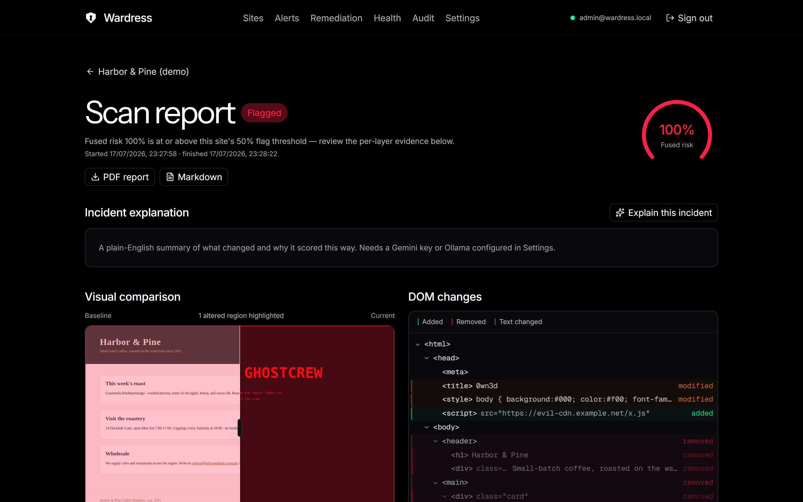

<p align="center">
  
</p>

<h1 align="center">Wardress</h1>

<p align="center">
  Self-hosted website defacement detection and response.<br>
  Nine detection layers, fused risk scoring, alerting, and guarded remediation — on your own machine.
</p>

---

Wardress watches the websites you care about, compares every scan against a
trusted baseline capture, and tells you the moment a page stops looking like
itself — with the evidence to prove it: a visual diff, a DOM change tree,
per-layer scores, and a plain-English incident explanation.


## How it works

Every site gets a **baseline**: a full-page screenshot and HTML capture taken
by a real browser (Playwright/Chromium). Scans re-capture the page and run it
through nine detection layers:

| Layer | What it checks |
|---|---|
| 1. Content hash | Byte-level change of the normalized page |
| 2. DOM structure | Added/removed/modified elements, injected scripts and iframes |
| 3. Visual diff | Screenshot comparison with altered-region highlighting |
| 4. Text semantics | Sentence-embedding drift of visible copy (MiniLM, fully local) |
| 5. Defacement vocabulary | Known defacement phrasing and patterns |
| 6. Resource integrity | New external scripts, forms, and resource origins |
| 7. Metadata | Title, charset, redirects, status codes, security headers |
| 8. Error/parked heuristics | Error pages and parked-domain swaps that fake a 200 |
| 9. Fusion | Weighted fusion of all layers into one 0–100% risk score |

A scan whose fused risk crosses the site's flag threshold is **flagged**: an
alert goes out on your channels, remediation hooks queue up (manual-confirm by
default), and the incident is preserved with artifacts for review.



## Features

- **SOC-style dashboard** — dark, keyboard-friendly React SPA: risk gauges,
  scan timelines, visual/DOM diff viewers, incident drilldowns.
- **Adaptive scheduling** — scans tighten to every few minutes right after a
  change and relax back while the site is stable. A Celery Beat dispatcher
  survives restarts with no state of its own.
- **Alerting that fails safe** — email (SMTP), Telegram, and 100+ services via
  Apprise URLs. A dead channel never blocks a scan or another channel.
  Deliveries are tracked per alert with status and error detail.
- **Guarded remediation** — per-site webhooks (maintenance page, cache purge,
  your own rollback endpoint) that trigger on a risk threshold. Manual-confirm
  by default: nothing fires until an analyst approves it in the queue.
- **Explain this incident** — optional plain-English incident summaries from
  Gemini (free tier) or a fully local Ollama model. Optional: everything works
  without it.
- **Bulk import** — paste CSV or point at a sitemap; up to 500 sites per
  batch with automatic baseline capture.
- **RBAC + API keys** — admin / analyst / viewer roles enforced server-side
  on every endpoint; per-user API keys for scripting (`wk_…`, SHA-256 at
  rest, revocable, honored at the owner's role).
- **Audit log** — every configuration change and remediation decision, with
  actor, before/after snapshots, and automatic secret redaction.
- **Reports** — one-click PDF and Markdown incident reports per scan.
- **Health page** — queue depth, worker liveness, Beat heartbeat, scan
  throughput. The watcher, watched.


## Requirements

- Windows 10/11 with [Docker Desktop](https://www.docker.com/products/docker-desktop/)
  (WSL 2 backend), running.
- ~6 GB free disk for images and data (Chromium worker image is the largest).
- No GPU needed. Nothing leaves your machine unless you configure alerts or
  the optional Gemini explainer.

The stack is plain Docker Compose (Postgres 16, Redis, FastAPI app, Playwright
worker, Celery Beat), so it also runs on Linux/macOS — only the installer
script is Windows-specific.

## Install

One command from a checkout:

```powershell
powershell -ExecutionPolicy Bypass -File scripts\install.ps1
```

The installer:

1. Verifies Docker Desktop is installed and the engine is running.
2. Generates `.env` from `.env.example`, replacing every `CHANGE_ME` with a
   cryptographically random secret (the DB password is kept in sync inside
   `DATABASE_URL`). An existing `.env` is never touched.
3. Builds the images serially, runs database migrations, starts the stack.
4. Seeds the admin user and creates a Desktop shortcut.
5. Prints the dashboard URL and — on first install only, exactly once — the
   generated admin credentials.

Then open **http://localhost:8321** (or the Desktop shortcut), sign in, and
add your first site. Optional flag: `-AdminEmail you@example.com`.

Optional services:

```powershell
docker compose --profile telegram up -d   # two-way Telegram bot
docker compose --profile ollama up -d     # fully local LLM for explanations
```

## Update

```powershell
powershell -ExecutionPolicy Bypass -File scripts\update.ps1
```

Pulls the latest code (`-NoGitPull` to skip), rebuilds, migrates the database,
and restarts services in the right order. Data, artifacts, and `.env` are
preserved.

## Uninstall

```powershell
docker compose down          # stop the stack (keeps data)
docker compose down -v       # stop AND delete all data volumes
```

Then delete the checkout folder and the Desktop shortcut. Secrets only ever
lived in `.env` inside the checkout.

## Configuration (`.env`)

Generated by the installer; edit and `docker compose up -d` to apply.

| Variable | Default | Purpose |
|---|---|---|
| `WARDRESS_HTTP_PORT` | `8321` | Dashboard/API port on localhost |
| `PUBLIC_BASE_URL` | `http://localhost:8321` | Link target used in alert messages |
| `POSTGRES_PASSWORD`, `DATABASE_URL` | generated | Database credentials (password embedded in the URL) |
| `JWT_SECRET` | generated | Signs access/refresh tokens (≥ 32 bytes enforced) |
| `CREDENTIALS_ENCRYPTION_KEY` | generated | Encrypts SMTP/Telegram/API credentials at rest (Fernet) |
| `ADMIN_EMAIL`, `ADMIN_PASSWORD` | generated | First admin (seed is idempotent; never resets a password) |
| `GEMINI_API_KEY`, `GEMINI_MODEL` | empty | Optional incident explanations via Gemini |
| `ENABLE_OLLAMA`, `OLLAMA_BASE_URL` | off | Optional fully local explanations |
| `TELEGRAM_BOT_TOKEN` | empty | Optional Telegram bot (with `--profile telegram`) |
| `RATE_LIMIT_PER_IP` | `300` | API requests per window per client IP (0 disables) |
| `RATE_LIMIT_PER_USER` | `240` | API requests per window per authenticated user |
| `RATE_LIMIT_WINDOW_SECONDS` | `60` | Rate-limit window length |
| `TRUST_PROXY_HEADERS` | `false` | Honor `X-Forwarded-For` — only behind a trusted proxy |
| `CORS_ALLOWED_ORIGINS` | empty | Extra origins if you host the SPA elsewhere (same-origin by default) |
| `COOKIE_SECURE` | `false` | Secure-flag the refresh cookie — set `true` behind HTTPS |

**HTTPS:** Wardress serves plain HTTP for the localhost self-hosted case. For
anything beyond localhost, front it with an HTTPS reverse proxy (Caddy, nginx,
Traefik) and set `PUBLIC_BASE_URL` to the `https://` address,
`TRUST_PROXY_HEADERS=true`, and `COOKIE_SECURE=true`.

## Roles

| Capability | Admin | Analyst | Viewer |
|---|:---:|:---:|:---:|
| View sites, scans, alerts, health, reports, artifacts | yes | yes | yes |
| Add/edit sites, scan now, rebaseline, suppression rules | yes | yes | – |
| Acknowledge alerts, confirm/dismiss remediation | yes | yes | – |
| Bulk import | yes | yes | – |
| Manage own API keys | yes | yes | yes |
| Notification channels, SMTP/Telegram/LLM settings | yes | – | – |
| Remediation hooks (create/edit) | yes | – | – |
| User management, audit log | yes | – | – |

Enforcement is server-side on every endpoint; hiding UI is only a courtesy.

## API

Interactive OpenAPI docs at `http://localhost:8321/docs`. Create an API key
in **Settings → API keys** (shown once, `wk_…`), then:

```bash
curl -H "Authorization: Bearer wk_YOUR_KEY" http://localhost:8321/api/sites
```

Keys act with their owner's role, can be revoked any time, and cannot manage
other keys or credentials — those require a real session.

## Security notes

- **SSRF policy** — scan targets resolve to public addresses only by
  default. Private/loopback/link-local targets require an explicit per-site
  opt-in (`allow_private_networks`), marked in the UI. Redirects are
  re-validated hop by hop, and webhook/Apprise deliveries go through the same
  guard.
- **Secrets at rest** — SMTP passwords, bot tokens, service URLs, and LLM
  keys are Fernet-encrypted with `CREDENTIALS_ENCRYPTION_KEY` before they
  reach the database and are never returned by the API (redacted hints only).
  API keys are stored as SHA-256 hashes. Audit entries redact secret fields.
- **Fail-safe alerting** — a broken channel, revoked key, or dead webhook
  endpoint can never break scanning. Failures are recorded per delivery and
  shown on the alert; remediation hooks default to manual confirmation.
- **Rate limiting** — per-IP and per-user API limits blunt floods and
  credential-stuffing; tune or disable via `.env`.

## Development

Backend: FastAPI + SQLAlchemy (async) + Alembic + Celery, managed with `uv`.
Frontend: React 19 + Vite + Tailwind v4, managed with `pnpm`.

```bash
cd backend && uv sync && uv run pytest          # 383 tests
cd frontend && pnpm install && pnpm test        # component tests
pnpm exec tsc --noEmit && pnpm exec oxlint src  # typecheck + lint
```

`PROGRESS.md` documents the build phases, architecture decisions, and QA
history end to end.
