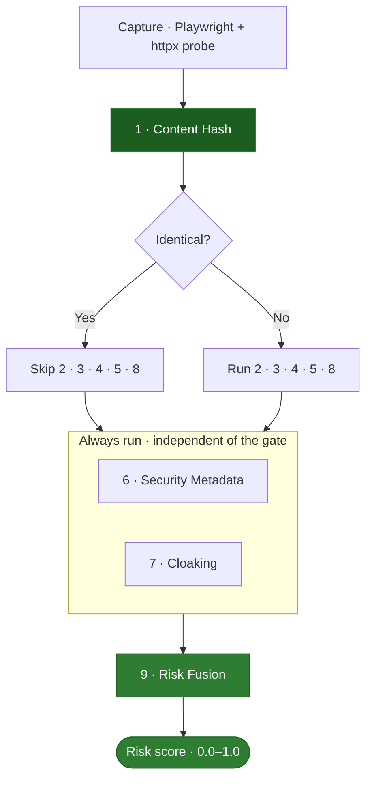
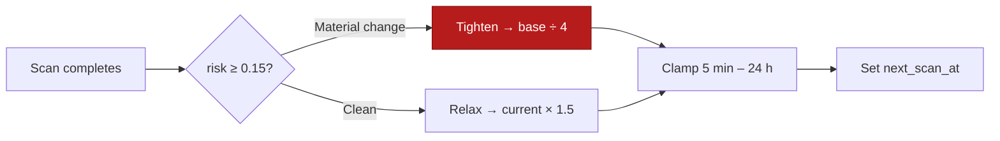

Every scan drives the target page through nine specialized layers, each designed to catch a different defacement style — from blunt script injections to stealthy semantic hijacking. The layers run in a fixed order with gating, then a machine-learning model fuses their scores into a single calibrated risk value.

<Info>
  Source of truth: `backend/worker/detection/pipeline.py` orchestrates the layers; each layer lives in its own module under `backend/worker/detection/`.
</Info>

## The pipeline at a glance

## Gating and optimizations

The pipeline uses gating rules to preserve resources and suppress false alarms from dynamic rendering.

<CardGroup cols={3}>
  <Card title="Hash gate" icon="hashtag">
    If the normalized content hash is identical to the baseline, Layers 2, 3, 4, 5, and 8 are skipped — byte-identical content cannot differ structurally, in links, visually, in signatures, or semantically. Each skip is logged with its reason.
  </Card>
  <Card title="Persistent probes" icon="rotate">
    Layers 6 (Security Metadata) and 7 (Cloaking) run on *every* scan regardless of the hash. TLS details, response headers, and UA-rotated fetches are invisible to the primary content hash and could reveal MITM or crawler-specific cloaking.
  </Card>
  <Card title="Crash isolation" icon="shield-xmark">
    Each layer runs inside its own `try/except`. A parser failure records the error as evidence, assigns score `None`, and lets the remaining layers continue — one broken parser must never blind the other eight.
  </Card>
</CardGroup>

## Layer breakdown

| Layer | Stable key | Input scope | Core heuristic |
| :--- | :--- | :--- | :--- |
| [1 · Content Hash](/layers/1-content-hash) | `layer1_hash` | Original HTML | SHA-256 over conservatively normalized HTML. Binary `0.0`/`1.0`. |
| [2 · DOM Structure](/layers/2-dom-structure) | `layer2_dom_structure` | Suppressed HTML | lxml tag-tree diff: churn, plus new `<script>`/`<iframe>`/hidden elements. |
| [3 · Link Audit](/layers/3-link-audit) | `layer3_link_audit` | Suppressed HTML | Set-diff of `script`/`a`/`link`/`iframe`/`form` references; new external domains dominate. |
| [4 · Visual Diff](/layers/4-visual-diff) | `layer4_visual_diff` | Screenshots | SSIM (0.7) + pHash/dHash (0.3) on masked grayscale captures. |
| [5 · Signatures](/layers/5-signatures) | `layer5_signatures` | New visible text | Weighted defacement phrases, profanity bursts, Unicode script flips. |
| [6 · Security Metadata](/layers/6-security-metadata) | `layer6_security_metadata` | TLS + headers + robots | Cert issuer/subject shifts, security-header downgrades, robots.txt changes. |
| [7 · Cloaking](/layers/7-cloaking) | `layer7_cloaking` | UA-rotated raw fetches | Jaccard divergence between Googlebot/mobile and the desktop reference. |
| [8 · Semantics](/layers/8-semantics) | `layer8_semantics` | Suppressed text | MiniLM cosine drift, aggression lexicon, defacement topic keywords. |
| [9 · Risk Fusion](/layers/9-risk-fusion) | `layer9_fusion` | Layers 1–8 | Seed-fitted logistic regression → one calibrated `0.0–1.0` score. |

<Note>
  **Input scope** matters. Layers 2, 3, 5, and 8 receive the *suppression-filtered* copy of both pages; Layer 4 gets bbox-masked screenshots; Layer 1 always hashes the *original* content so tampering is never hidden. Layers 6 and 7 read transport and per-UA data, not the primary DOM.
</Note>

## Adaptive cadence scanning

Wardress scales monitoring frequency by the fused risk score, so real changes are watched closely without wasting resources on stable sites.

- **Material-change threshold:** `MATERIAL_CHANGE_RISK = 0.15` — deliberately below any sane flag threshold (so real change is watched before it becomes alarming) and above dynamic-content noise.
- **Tighten:** a detected change sets the next interval to `base ÷ 4`.
- **Relax:** each subsequent clean scan multiplies the interval by `1.5`, walking back up to the site's configured base.
- **Clamp:** every interval is bounded to `[5 minutes, 24 hours]`.

The Celery Beat dispatcher ticks every 60 seconds and enqueues sites whose `next_scan_at` is due; the adaptive state lives in the database, so a Beat restart loses nothing.
