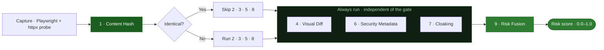
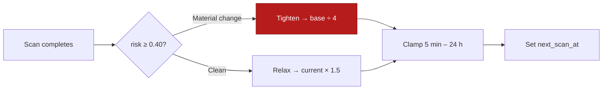

Every scan drives the target page through nine specialized layers, each designed to catch a different defacement style — from blunt script injections to stealthy semantic hijacking. The layers run in a fixed order with gating, then a machine-learning model fuses their scores into a single risk value in `0.0–1.0` (a ranking signal with rule-based floors, not a calibrated probability).

<Info>
  Source of truth: `backend/worker/detection/pipeline.py` orchestrates the layers; each layer lives in its own module under `backend/worker/detection/`.
</Info>

## The pipeline at a glance

```mermaid actions={true}
flowchart LR
    F[Capture · Playwright + httpx probe] --> L1[1 · Content Hash]
    L1 --> G{Identical?}
    G -->|Yes| GATE[Skip 2 · 3 · 5 · 8]
    G -->|No| CONTENT[Run 2 · 3 · 5 · 8]
    GATE --> ALWAYS
    CONTENT --> ALWAYS
    subgraph ALWAYS [Always run · independent of the gate]
      direction TB
      L4[4 · Visual Diff]
      L6[6 · Security Metadata]
      L7[7 · Cloaking]
    end
    ALWAYS --> L9[9 · Risk Fusion]
    L9 --> RISK([Risk score · 0.0–1.0])

    classDef hash fill:#1b5e20,stroke:#2e7d32,color:#fff;
    classDef fusion fill:#2e7d32,stroke:#1b5e20,color:#fff;
    class L1 hash;
    class L9 fusion;
    class RISK fusion;
    style ALWAYS fill:#0f1f12,stroke:#2e7d32,color:#a5d6a7;
```

## Gating and optimizations

The pipeline uses gating rules to preserve resources and suppress false alarms from dynamic rendering.

<Card title="Hash gate" icon="hashtag">
  If the normalized content hash is identical to the baseline, Layers 2, 3, 5, and 8 are skipped — the hash is computed over the serialized DOM, so an identical hash proves those DOM-derived views unchanged. Layer 4 (Visual Diff) runs on every scan regardless of the gate: rendered pixels depend on externally-referenced assets that the serialized DOM never contains. Each skip is logged with its reason.
</Card>

<CardGroup cols={2}>
  <Card title="Volatile-text normalization" icon="wand-magic-sparkles">
    Before layers 2/3/5/8 compare anything, an automatic conservative pass replaces universally-volatile text on <em>both</em> sides: ISO 8601 timestamps and date stamps, UUIDs, cache-busting query values (`?v=…`, `?_=…` — value-shape-guarded), and CSRF/token nonce values. Injected words, headlines, and signatures are never normalized; layer 1 still hashes the raw bytes. When the pass replaced anything, the layers' evidence carries a `normalization_applied` summary.
  </Card>
  <Card title="Persistent probes" icon="rotate">
    Layers 6 (Security Metadata) and 7 (Cloaking) run on *every* scan regardless of the hash. TLS details, response headers, and UA-rotated fetches are invisible to the primary content hash and could reveal MITM or crawler-specific cloaking.
  </Card>
  <Card title="Crash isolation" icon="shield-xmark">
    Each layer runs inside its own `try/except`. A parser failure records the error as evidence, assigns score `None`, and lets the remaining layers continue — one broken parser must never blind the other eight.
  </Card>
</CardGroup>

## Layer breakdown

| Layer | Stable key | Input scope | Core heuristic |
| :--- | :--- | :--- | :--- |
| [1 · Content Hash](/layers/1-content-hash) | `layer1_hash` | Original HTML | SHA-256 over conservatively normalized HTML. Binary `0.0`/`1.0`. |
| [2 · DOM Structure](/layers/2-dom-structure) | `layer2_dom_structure` | Suppressed + normalized HTML | lxml tag-tree diff: churn, plus new `<script>`/`<iframe>` and hidden elements — hiding is resolved through inline styles *and* the page's own stylesheets. |
| [3 · Link Audit](/layers/3-link-audit) | `layer3_link_audit` | Suppressed + normalized HTML | Set-diff of `script`/`a`/`link`/`iframe`/`form` references (browser-faithful URL normalization); new external domains dominate. |
| [4 · Visual Diff](/layers/4-visual-diff) | `layer4_visual_diff` | Screenshots | SSIM (0.7) + pHash/dHash (0.3) on masked grayscale captures, plus a chroma-shift term so hue-only changes register. |
| [5 · Signatures](/layers/5-signatures) | `layer5_signatures` | Normalized new visible text | Weighted defacement phrases (matched raw and leet-decoded), profanity bursts, Unicode script flips or foreign-script inflow. |
| [6 · Security Metadata](/layers/6-security-metadata) | `layer6_security_metadata` | TLS + headers + robots | Cert issuer/subject shifts, security-header downgrades, robots.txt changes. |
| [7 · Cloaking](/layers/7-cloaking) | `layer7_cloaking` | UA-rotated raw fetches | Jaccard divergence between Googlebot/mobile and the desktop reference, graded with a churn grace so dynamic bits stay silent. |
| [8 · Semantics](/layers/8-semantics) | `layer8_semantics` | Suppressed + normalized text | MiniLM cosine drift, aggression lexicon, defacement topic keywords. |
| [9 · Risk Fusion](/layers/9-risk-fusion) | `layer9_fusion` | Layers 1–8 | Non-negative-fitted logistic regression + rule-based minimum-risk floors → one `0.0–1.0` ranking score. |

<Note>
  **Input scope** matters. Layers 2, 3, 5, and 8 receive the *suppression-filtered* and *volatility-normalized* copy of both pages (user rules first, then the automatic volatile-text pass — so a rule written against literal raw text still matches); Layer 4 gets bbox-masked screenshots; Layer 1 always hashes the *original* content so tampering is never hidden. Layers 6 and 7 read transport and per-UA data, not the primary DOM.
</Note>

## Verdicts

Each completed scan gets one of three verdicts:

- **flagged** — fused risk ≥ the site's flag threshold. Creates an alert and (for ready hooks) remediation executions.
- **changed** — at least one non-skipped layer scored above the verdict noise floor (`NOISE_FLOOR = 0.02`, `worker/scan_tasks.py`). Residue that individual layers cannot fully normalize away (a tracked timestamp, a metadata rounding) no longer keeps a stable site in permanent "changed".
- **clean** — everything else.

The noise floor is verdict-only: it never touches the fused risk score and never affects flagging. Unambiguous attack evidence cannot hide behind it — the rule-based minimum-risk floors (layer 5/7 ≥ 0.85 → floor 0.90, layer 3 ≥ 0.55 → floor 0.40) bypass the verdict floor entirely.

## Regression corpus

A compact, deterministic regression corpus (`backend/worker/detection/training/regression_corpus.json`, built by `backend/tools/build_regression_corpus.py` from the same scenario builders as the fusion training dataset) re-measures a strict subset of attack and benign-dynamic axes through the real pipeline on every deliberate regeneration. `backend/tests/test_detection_regression.py` pins the detectors' aggregate behavior against the committed artifact — every attack scenario still reads "changed" with a content layer above the verdict noise floor, attack axes keep a minimum detection strength (or their channel is covered by a rule floor), benign-dynamic churn stays below the material-change band, and each stored fused risk reproduces from the stored features through the deployed fusion layer. The test also rebuilds the corpus in-process and requires a row-for-row match with the committed artifact, so a detector or scenario-builder change that alters any measured row fails loudly instead of drifting silently. Regenerate the artifact deliberately (with the tool in `backend/tools/`) whenever detector behavior changes on purpose, and re-verify the pinned invariants as part of that change.

## Adaptive cadence scanning

Wardress scales monitoring frequency by the fused risk score, so real changes are watched closely without wasting resources on stable sites.

```mermaid actions={true}
%%{init: {'flowchart': {'padding': 24}}}%%
flowchart LR
    SCAN[Scan completes] --> Q{risk ≥ 0.40?}
    Q -->|Material change| T["Tighten → base ÷ 4"]
    Q -->|Clean| R["Relax → current × 1.5"]
    T --> C[Clamp 5 min – 24 h]
    R --> C
    C --> N[Set next_scan_at]

    classDef hot fill:#b71c1c,stroke:#7f1010,color:#fff;
    class T hot;
```

- **Material-change threshold:** `MATERIAL_CHANGE_RISK = 0.40` — deliberately below the default flag threshold (so real change is watched before it becomes alarming), aligned with the LLM escalation floor, and above the fused risk that pure dynamic-content noise produces under the deployed fusion model (re-measured with the current layer code after the volatile-text normalization + churn-weighting passes: rotating ads, timestamps/counters, cache-busting refs, CSS churn and mixed noise fuse to ~0.14–0.15, editorial rewrites to ~0.30; A/B hero swaps are genuine content deltas and can reach ~0.44 via the semantics layer).
- **Tighten:** a detected change sets the next interval to `base ÷ 4`.
- **Relax:** each subsequent clean scan multiplies the interval by `1.5`, walking back up to the site's configured base.
- **Clamp:** every interval is bounded to `[5 minutes, 24 hours]`.

The Celery Beat dispatcher ticks every 60 seconds and enqueues sites whose `next_scan_at` is due; the adaptive state lives in the database, so a Beat restart loses nothing.
