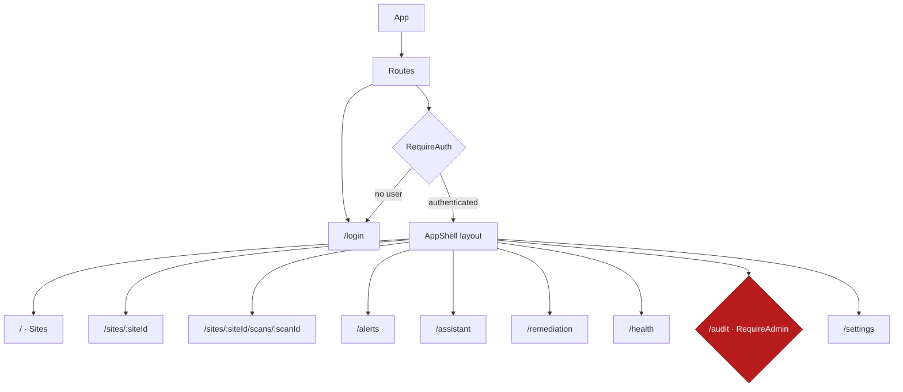

The Wardress frontend is a React 19 single-page application served by the FastAPI container. It reflects the state of a remote database in real time — sites, scans, alerts, health — so it leans heavily on server-state caching rather than a client-side store.

<Info>
  Source: `frontend/package.json`, `frontend/src/App.tsx`, `frontend/src/lib/api.ts`, `frontend/src/lib/auth.tsx`, `frontend/src/index.css`.
</Info>

## Tech stack

<CardGroup cols={2}>
  <Card title="React 19 + Vite" icon="react">
    React 19 with Vite 8 for the build and dev server. TypeScript throughout; linting via oxlint; tests via Vitest with Testing Library.
  </Card>
  <Card title="Tailwind CSS v4" icon="palette">
    Styling via the `@tailwindcss/vite` plugin and `tw-animate-css`. Design tokens are defined in `index.css` under `@theme`.
  </Card>
  <Card title="TanStack React Query v5" icon="database">
    Server-state cache, background refetching, and mutation-driven invalidation. `refetchOnWindowFocus` is disabled globally.
  </Card>
  <Card title="React Router v8" icon="route">
    Client-side routing with a nested authenticated layout and parameterized scan URLs.
  </Card>
</CardGroup>

Other notable libraries: **Radix UI** (the unified `radix-ui` package) for accessible primitives, **Recharts** for the risk gauge and incident timeline, **Sonner** for toasts, **lucide-react** for icons, and `class-variance-authority` + `tailwind-merge` for variant styling. The package manager is pnpm.

## Routing and auth guard

`RequireAuth` shows a loading state while the session resolves, then redirects unauthenticated users to `/login`. `RequireAdmin` wraps `/audit` — a UX-only gate, since the API enforces the role server-side regardless. Any unknown path redirects to `/`.

## State management

Wardress uses **TanStack React Query** as its primary state layer. Because the dashboard mirrors remote database state, storing that data in Redux or Context would be an anti-pattern.

- **Adaptive polling** — pages set `refetchInterval` to match how fast their data changes: Health polls every 10s, Remediation every 15s, Alerts every 30s, while Sites, Site Detail, and Scan Detail use *function-based* intervals that poll faster while a scan is in flight and back off when idle.
- **Cache invalidation** — mutations (acknowledging an alert, confirming a remediation) invalidate the relevant query keys, so the UI updates without a reload.
- **Pagination** — large datasets like the audit log page through React Query with preserved previous data for seamless transitions.

## Security controls

The frontend is an active participant in the platform's security posture.

<AccordionGroup>
  <Accordion title="In-memory access token" icon="key">
    The access token lives in module memory only — never `localStorage` or `sessionStorage` — so an XSS payload cannot steal a persistent credential. The refresh token is an `HttpOnly` cookie scoped to `/api/auth`, invisible to JavaScript.
  </Accordion>
  <Accordion title="Silent refresh with single-flight" icon="rotate">
    On a `401` (for non-auth routes) the client attempts one silent `POST /api/auth/refresh` and replays the original request. All callers share **one** in-flight refresh via a single-flight promise: the backend rotates the refresh token on every use and treats reuse of a rotated token as theft (revoking the whole session family), so two parallel refreshes would log the user out. React StrictMode's double-mounted boot effect relies on this too.
  </Accordion>
  <Accordion title="Error-detail sanitization" icon="shield-halved">
    `sanitizeApiDetail` strips backend tracebacks and internal file paths from surfaced error messages, replacing them with a generic message so implementation details never leak to the UI.
  </Accordion>
  <Accordion title="RBAC-aware rendering" icon="user-lock">
    The UI conditionally hides controls a user's role cannot use (for example, the admin-only audit route and admin-only settings). This is convenience, not enforcement — every permission is checked server-side.
  </Accordion>
</AccordionGroup>

<Note>
  Authentication is bearer-token based (in-memory access token, `HttpOnly` refresh cookie). The API client attaches the token via the `Authorization` header; it does not implement a separate CSRF-token header — the sensitive refresh cookie is path-scoped to `/api/auth` and used only by the dedicated refresh endpoint.
</Note>

## Theme

The design system is dark-first and built on **true black** (`--color-canvas: #000000`), not near-black slate. Hairline borders (`rgba(255,255,255,0.06)`) replace drop shadows, and accents appear as glows rather than solid fills.

| Token | Value | Use |
| :--- | :--- | :--- |
| `--color-canvas` | `#000000` | Page background |
| `--color-surface-card` | `#0a0a0c` | Cards |
| `--color-accent-green` | `#11ff99` | Clean / healthy |
| `--color-accent-orange` | `#ff801f` | Investigating band |
| `--color-accent-red` | `#ff2047` | Flagged / destructive |

Typography uses **Fraunces** (display serif), **Instrument Sans** (display sans), **Inter** (body/UI), and **Geist Mono** (code, hashes, IPs) — all self-hosted via Fontsource.

<Info>
  The dashboard is optimized for large desktop monitors typical of operations centers, and components degrade gracefully on smaller screens.
</Info>
