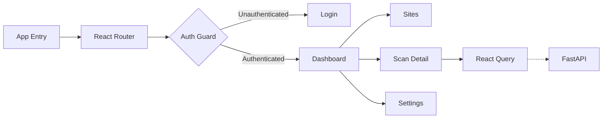

The Wardress frontend is a fast, modern Single Page Application (SPA) designed to provide real-time security monitoring without page reloads.

## Tech Stack

Wardress's frontend is built on industry-leading open-source libraries:

<CardGroup cols={2}>
  <Card title="React 19 & Vite" icon="react">
    Provides the core component architecture and blazing-fast hot module replacement during development.
  </Card>
  <Card title="Tailwind CSS v4" icon="css3">
    Handles all styling via utility classes, allowing for the deep atmospheric dark mode and glowing alerts.
  </Card>
  <Card title="React Query" icon="database">
    Manages server state, caching, and automatic background refetching for real-time dashboard updates.
  </Card>
  <Card title="React Router" icon="route">
    Provides client-side routing, nested layouts, and parameterized URLs for deep-linking into specific scans.
  </Card>
</CardGroup>

## Application Flow

## State Management

Wardress relies primarily on **TanStack React Query** for state management. Because Wardress is a dashboard that reflects the state of a remote database (scan results, alerts, system health), storing this data in Redux or Context is an anti-pattern. 

React Query handles:
- **Polling**: The `health.tsx` dashboard automatically polls the backend every 5 seconds to update CPU/RAM usage.
- **Cache Invalidation**: When an operator acknowledges an alert, the mutation automatically invalidates the `alerts` query key, instantly removing the alert from the UI without a page reload.
- **Pagination**: Large datasets like the Audit Log use React Query's `keepPreviousData` to provide seamless pagination transitions.

## Security Controls

The frontend actively participates in Wardress's security posture:
- **JWT Storage**: The frontend never stores tokens in `localStorage`. Access tokens are kept entirely in memory, while refresh tokens are handled securely via `HttpOnly` cookies.
- **CSRF Protection**: All state-mutating requests (POST, PUT, DELETE) include CSRF protection headers validated by the FastAPI backend.
- **RBAC UI Hiding**: While the backend strictly enforces permissions, the frontend also conditionally renders UI elements. For example, a user with the `Viewer` role will not even see the "Acknowledge" button on an alert, preventing user confusion.
