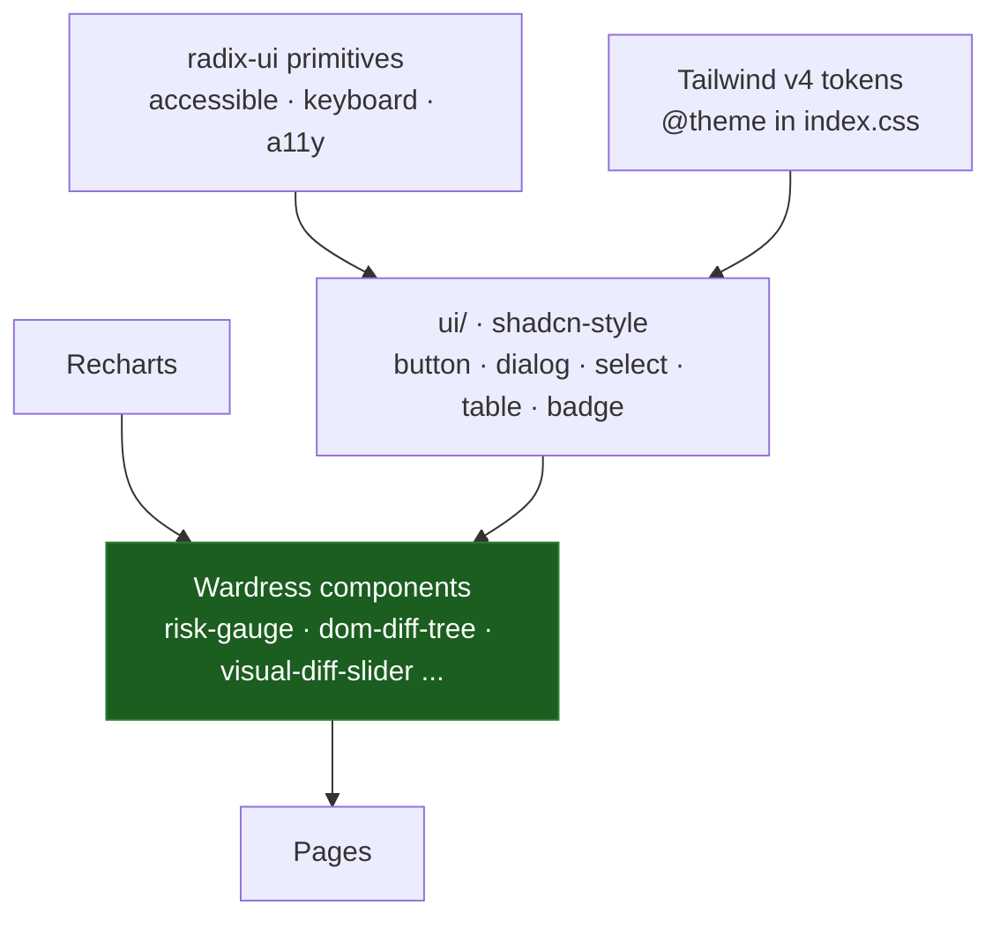

The frontend has two component tiers: low-level primitives in `src/components/ui/` (Radix-backed, shadcn-style) and higher-level Wardress components in `src/components/` that compose them into the dashboard's forensic surfaces.

<Info>
  Source: `frontend/src/components/`. Primitives wrap the unified `radix-ui` package; charts use Recharts; toasts use Sonner.
</Info>

## Component layering

## Primitives (`ui/`)

Thin, restyled wrappers over Radix primitives, each mapped onto the Wardress design tokens: `button`, `badge` (both use Radix `Slot` for `asChild`), `dialog`, `label`, `select`, `input`, `card`, `table`, `sonner` (toaster), and `spotlight-card` (a pointer-tracking glow surface).

## Core Wardress components

### `<RiskGauge>`

A radial gauge built on **Recharts** `RadialBarChart` (a 225°→−45° arc), not a hand-built SVG. It renders the fused risk as a percentage with a tone driven by `riskTone(risk, threshold)`:

- `risk >= threshold` → red (`#ff2047`) — flagged.
- `risk >= 0.15` → orange (`#ff801f`) — the scheduler's material-change band.
- otherwise → green (`#11ff99`) — clean.

The track is a hairline white; the value arc is the accent color at a thin stroke.

### `<StatusDot>`

A small status indicator used across the sites list to show a site's real-time state (monitored/clean, flagged, or paused), keeping the list scannable at a glance.

### `<DomDiffTree>`

Used only in the scan-detail view. It takes the JSON DOM-diff representation and renders it recursively — calling itself to render nested child nodes — so an analyst can expand and collapse HTML nodes to locate an injected element, with added and removed nodes visually distinguished.

### `<VisualDiffSlider>`

Overlays the current capture on the baseline with a draggable wipe handle, so an analyst can slide between the two images to spot pixel-level tampering without comparing side-by-side.

### `<IncidentTimeline>`

A Recharts-based visualization of a scan or site's event history.

### Panels and cards

Higher-level surfaces compose the primitives into feature panels: `finding-card` (per-layer evidence), `remediation-hooks-panel`, `suppression-panel`, `api-keys-card`, `users-card`, `bulk-import-dialog`, and `app-shell` (the authenticated layout with navigation). `wardress-mark` renders the brand mark.

## Theme and styling

The theme is dark-first over **true black** (`#000000`). Hairline borders replace drop shadows; accents render as glows rather than solid fills. Design tokens (colors, radii, font stacks) live in `index.css` under Tailwind v4's `@theme` block and are mapped onto shadcn's semantic names (`background`, `primary`, `border`, `ring`, …) so every primitive renders in the Wardress skin.

- **Backgrounds:** true black canvas, near-black card surfaces (`#0a0a0c`).
- **Borders:** subtle semi-transparent white hairlines (`rgba(255,255,255,0.06)`).
- **Typography:** Inter for UI, Geist Mono for hashes/IPs/code, Fraunces and Instrument Sans for display.

<Info>
  Radix primitives give the component library accessible focus management, keyboard navigation, and screen-reader semantics out of the box.
</Info>
