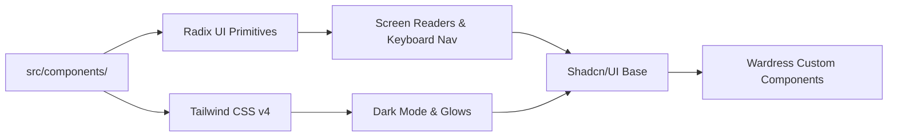

The Wardress frontend utilizes a custom design system heavily inspired by high-end, cyberpunk-adjacent cybersecurity tooling. It avoids flat, generic corporate styling in favor of glowing indicators, rigid mono-spaced typography for data, and stark contrast.

## Architecture

## Core Visual Components

### `<RiskGauge>`
A circular SVG progress indicator used to visualize the `0.0 - 1.0` risk score. 
It uses dynamic Tailwind classes to shift colors based on severity:
- `< 0.3`: Green (`text-emerald-500`)
- `0.3 - 0.7`: Yellow (`text-amber-500`)
- `> 0.7`: Red (`text-red-500` with an SVG `drop-shadow` for a glowing effect).

### `<StatusDot>`
A pulsing micro-animation used in the Global Sites list to indicate a site's real-time status. It uses Tailwind's `@keyframes` to create a radar-ping effect.
- **Pulsing Green**: Site is actively being monitored and is currently clean.
- **Solid Red**: Site has crossed the flag threshold and requires immediate attention.
- **Gray**: Site monitoring is paused or muted.

### `<DomDiffTree>`
A highly specialized component used exclusively in the `scan-detail` view. It takes a JSON representation of an HTML DOM diff and renders it recursively. It utilizes recursive React rendering, calling itself to render deeply nested child elements, allowing analysts to expand and collapse HTML nodes to find the exact line of an injected script.

## Theme & Styling

Wardress strictly enforces a **Dark Mode First** aesthetic. The `index.css` file defines global CSS variables tailored specifically for dark interfaces:

- **Backgrounds**: Deep, unsaturated slates (`#0f172a`).
- **Borders**: Subtle, semi-transparent whites (`rgba(255, 255, 255, 0.1)`).
- **Typography**: Uses the `Inter` font family for readability and standard mono-spaced fonts for all code blocks, IPs, and hashes.

<Info>
  **Responsive Design**: While the core dashboard is optimized for large desktop monitors (as cybersecurity operations centers typically utilize 1080p+ screens), all components are fully responsive and degrade gracefully on mobile devices.
</Info>
