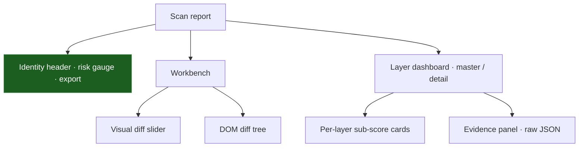

The `scan-detail.tsx` page is the most complex surface in the frontend. It is an interactive forensic workbench that lets an analyst drill from the fused risk score down into the raw evidence each layer produced.

<Info>
  Route: `/sites/:siteId/scans/:scanId`. Source: `frontend/src/pages/scan-detail.tsx`, using `dom-diff-tree`, `visual-diff-slider`, `risk-gauge`, and `finding-card`.
</Info>

## Layout

While a scan is still in flight, the page polls with a function-based `refetchInterval` that backs off once the scan completes.

## Key components

### Visual diff slider

Rather than placing two screenshots side by side, the slider overlays the current capture directly on the baseline. Dragging the handle wipes between them, making newly injected elements and visual tampering immediately obvious in one viewport.

### DOM diff tree

When structure changed, the DOM diff tree shows *where*. It renders the diff recursively — expanding and collapsing nested nodes — and distinguishes added from removed elements, so an analyst can pinpoint an injected `<script>` or hidden `<iframe>`.

### Layer dashboard (master–detail)

Below the workbench, cards represent the detection layers. Each shows that layer's sub-score, color-coded by severity. Selecting a card populates an evidence panel with the raw JSON that layer emitted — for example the applied `suppression` summary, the MiniLM `semantic_similarity` float, the Jaccard `similarity` per UA variant, or the fusion `contributions` per layer. This is the same evidence the worker pipeline wrote to the findings row, surfaced verbatim.

## Report export

Analysts often need to attach scan evidence to an external ticket (Jira, ServiceNow).

<Steps>
  <Step title="Action">
    The analyst clicks "PDF report" or the Markdown button in the identity header.
  </Step>
  <Step title="Authenticated blob fetch">
    The client requests the report through the authenticated API client and builds an object URL with `URL.createObjectURL()`. A plain `<a href>` download can't carry the `Authorization` header, so the bytes are fetched in JavaScript and wrapped in a blob.
  </Step>
  <Step title="Download">
    The backend renders the document — PDFs via **WeasyPrint**, Markdown via the report assembler — and the client triggers a hidden anchor to open the browser's native save dialog with the returned filename.
  </Step>
</Steps>

<Note>
  The Markdown export bundles referenced assets (screenshots, the incident-timeline SVG) so the exported report is self-contained.
</Note>
