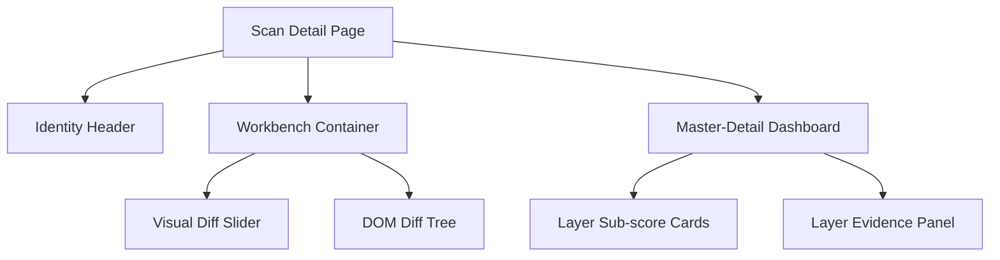

The `scan-detail.tsx` page is the most complex surface in the Wardress frontend. It acts as an interactive forensic workbench, allowing analysts to drill down into exactly why a scan was flagged.

## The Workbench Layout

The layout abandons standard web paradigms in favor of an atmospheric, "glassmorphism" desktop application feel.

## Key Components

### The Visual Diff Slider
Rather than showing two static screenshots side-by-side (which takes up too much horizontal space and makes finding pixel-level changes impossible), the Visual Diff Slider overlays the current scan directly on top of the baseline. 

An interactive slider handle allows the analyst to drag left and right, wiping between the two images to instantly spot visual tampering or newly injected elements.

### The DOM Diff Tree
If the Visual layer detects a change, the DOM Diff Tree visualizes exactly *where* in the HTML structure the change occurred. It parses the baseline and current HTML into a diffable tree structure and renders it using nested components, highlighting added tags in green and removed tags in red.

### The Inspectable Layer Dashboard
Below the workbench sits the Master-Detail layer dashboard. 
1. **Master View**: Nine distinct cards represent the 9 detection layers. Each card shows the exact `0.0 - 1.0` sub-score generated by that layer, color-coded by severity.
2. **Detail View**: Clicking on a layer card updates a master evidence panel. This panel renders the raw JSON evidence (like the `suppression_applied` rules, the specific `all-MiniLM` cosine similarity floats, or the `Jaccard` token overlaps) extracted from the Celery worker pipeline.

## Report Generation (Export)

Analysts often need to export scan evidence for external ticketing systems (like Jira or ServiceNow).

<Steps>
  <Step title="Action">
    The user clicks the "PDF Report" or "Markdown" button in the identity header.
  </Step>
  <Step title="Blob Fetch">
    The frontend initiates an authenticated API request to the backend using `URL.createObjectURL()`. This is necessary because a standard `<a href="...">` download link cannot pass the Bearer JWT token required for authentication.
  </Step>
  <Step title="Download">
    Once the backend (using `WeasyPrint` for PDFs) finishes rendering the document, the frontend automatically clicks a hidden anchor tag to trigger the browser's native file download dialog.
  </Step>
</Steps>
