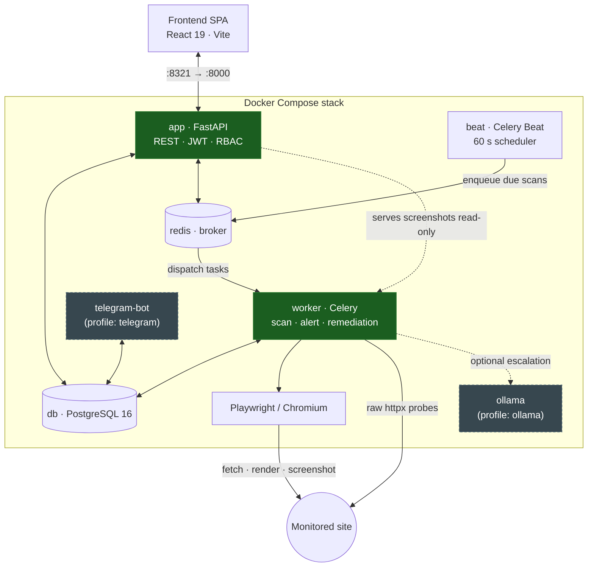

## Overview

**Wardress** is a production-grade, self-hosted security tool built to protect website integrity. It captures and freezes a trusted **baseline** of your target website (DOM structure, network references, visual layout, and textual semantics) and continuously monitors the site for malicious defacements, script injections, metadata tampering, and domain hijacking.

Unlike simple page monitors, Wardress uses a **fused risk model** that aggregates results from 9 independent detection layers to calculate a single, highly accurate risk score. This filters out false positives caused by minor dynamic elements while raising immediate alarms when a site has been compromised.

<CardGroup cols={2}>
  <Card
    title="9-Layer Pipeline"
    icon="layer-group"
    href="/detection-layers"
  >
    Deep analysis using DOM, visual, semantic, and metadata layers.
  </Card>
  <Card
    title="Automated Response"
    icon="bolt"
    href="/usage#remediation-hooks"
  >
    Trigger webhooks to isolate or rollback compromised systems automatically.
  </Card>
  <Card
    title="AI Incident Assistant"
    icon="robot"
    href="/usage#ai-incident-assistant"
  >
    Get plain-English incident summaries from Gemini or a local Ollama model.
  </Card>
  <Card
    title="Self-Hosted & Private"
    icon="server"
    href="/installation"
  >
    Run everything on your own infrastructure via Docker Compose.
  </Card>
</CardGroup>

## System architecture

Wardress is a set of containerized services coordinated by **Docker Compose**. The API and the workers share one codebase but run as separate containers, communicating only through PostgreSQL (durable state) and Redis (the task broker).

### Core services

- **Frontend SPA** — a React 19 single-page app built with Vite and Tailwind CSS v4, served by the API container. Visual diffing, DOM diff trees, audit logs, and interactive controls.
- **`app` (FastAPI)** — an async REST API with JWT session management, role-based access control, and cryptographically hashed API keys. Binds host port `8321` to container port `8000`. Mounts the scan artifact volume read-only to serve screenshots.
- **`db` (PostgreSQL 16)** — durable store for sites, baselines, scans, findings, alerts, audit log, users, and encrypted settings.
- **`redis`** — the Celery broker and the store for the health heartbeat.
- **`worker` (Celery)** — executes scans (Playwright capture, the 9-layer pipeline), alert dispatch, and remediation webhooks. The only container that writes scan artifacts.
- **`beat` (Celery Beat)** — a fixed 60-second scheduler that enqueues sites whose next scan is due; all adaptive-cadence state lives in the database.

### Optional services (opt-in profiles)

- **`telegram-bot`** — a two-way Telegram surface for the AI agent. Started with `docker compose --profile telegram up -d`.
- **`ollama`** — a fully offline LLM for incident explanations, so no page text leaves your host. Started with `docker compose --profile ollama up -d`.

<Card title="Ready to get started?" icon="rocket" href="/installation">
  Head over to the Installation guide to deploy Wardress on your local machine or server.
</Card>
