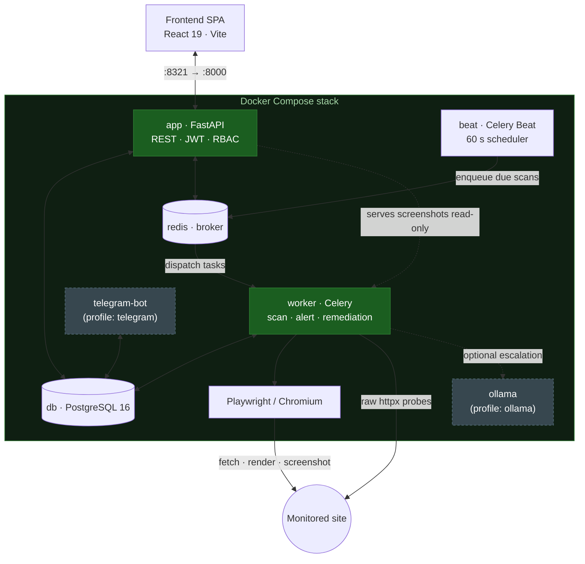

## Overview

**Wardress** is a production-grade, self-hosted security tool built to protect website integrity. It captures and freezes a trusted **baseline** of your target website (DOM structure, network references, visual layout, and textual semantics) and continuously monitors the site for malicious defacements, script injections, metadata tampering, and domain hijacking.

Unlike simple page monitors, Wardress aggregates results from 9 independent detection layers into a single fused risk score. Rule-based minimum-risk floors keep high-specificity attack evidence (new external script domains, defacement signatures, crawler cloaking) from being drowned out, while ordinary churn — rotating ads, timestamps, cache-busting references — measures far below the alerting bar. Changes that clear a site's flag threshold raise alerts immediately; subtler changes are still scored and recorded, significant ones shorten the scan interval and can request a second opinion from a configured AI model, so ambiguous incidents reach operator review instead of disappearing. Detection sensitivity varies by attack technique, and per-site flag thresholds are tunable.

<CardGroup cols={3}>
  <Card
    title="9-Layer Pipeline"
    icon="layer-group"
    href="/detection-layers"
  >
    Analyze DOM tree deltas, visual SSIM/pHash diffs, link audits, signature
    lexicons, TLS metadata, and MiniLM semantics fused into a 0.0–1.0 risk
    score.
  </Card>
  <Card
    title="Automated Response"
    icon="bolt"
    href="/usage#remediation-hooks"
  >
    Dispatch signed HMAC webhooks, alert channels, and automated rollback or
    isolation workflows across CDNs, proxies, and custom infrastructure on
    confirmed incidents.
  </Card>
  <Card
    title="AI Incident Assistant"
    icon="robot"
    href="/usage#ai-incident-assistant"
  >
    Get plain-English incident summaries from any AI provider you configure — a
    cloud model (OpenAI, Groq, Anthropic, Google, Mistral, …) or a fully local
    Ollama model.
  </Card>
</CardGroup>

<Card
  title="Self-Hosted"
  icon="server"
  href="/installation"
>
  Run the entire stack on your own infrastructure via Docker Compose.
  Dashboard imagery is bundled same-origin by default — site avatars are
  local letter tiles, provider logos and the AI mark ship with the app,
  and no browser request ever reaches a third-party image CDN. An
  opt-in server-side favicon resolver exists (Settings → Site favicons)
  but is OFF by default; when enabled, your own server fetches each
  monitored site's icon once and caches it locally. Incident data
  leaves your host only through channels you configure (notifications,
  webhooks, AI providers — pick the local Ollama profile to keep AI
  analysis fully offline).
</Card>

## System architecture

Wardress is a set of containerized services coordinated by **Docker Compose**. The API and the workers share one codebase but run as separate containers, communicating only through PostgreSQL (durable state) and Redis (the task broker).

```mermaid actions={true}
flowchart TB
    UI[Frontend SPA<br/>React 19 · Vite]
    subgraph HOST [Docker Compose stack]
      direction TB
      API["app · FastAPI<br/>REST · JWT · RBAC"]
      DB[("db · PostgreSQL 16")]
      REDIS[("redis · broker")]
      BEAT["beat · Celery Beat<br/>60 s scheduler"]
      WORKER["worker · Celery<br/>scan · alert · remediation"]
      PW[Playwright / Chromium]
      TG["telegram-bot<br/>(profile: telegram)"]
      OL["ollama<br/>(profile: ollama)"]
    end
    TARGET((Monitored site))

    UI <-->|:8321 → :8000| API
    API <--> DB
    API <--> REDIS
    BEAT -->|enqueue due scans| REDIS
    REDIS -->|dispatch tasks| WORKER
    WORKER <--> DB
    WORKER --> PW
    PW -->|fetch · render · screenshot| TARGET
    WORKER -->|raw httpx probes| TARGET
    API -.serves screenshots read-only.-> WORKER
    TG <--> DB
    WORKER -.optional escalation.-> OL

    classDef core fill:#1b5e20,stroke:#2e7d32,color:#fff;
    classDef opt fill:#37474f,stroke:#546e7a,color:#fff,stroke-dasharray:4 3;
    class API,WORKER core;
    class TG,OL opt;
    style HOST fill:#0f1f12,stroke:#2e7d32,color:#a5d6a7;
```

### Core services

- **Frontend SPA** — a React 19 single-page app built with Vite and Tailwind CSS v4, served by the API container. Visual diffing, DOM diff trees, audit logs, and interactive controls.
- **`app` (FastAPI)** — an async REST API with JWT session management, role-based access control, and cryptographically hashed API keys. Binds host port `8321` to container port `8000`. Mounts the scan artifact volume read-only to serve screenshots.
- **`db` (PostgreSQL 16)** — durable store for sites, baselines, scans, findings, alerts, audit log, users, and encrypted settings.
- **`redis`** — the Celery broker and the store for the health heartbeat.
- **`worker` (Celery)** — executes scans (Playwright capture, the 9-layer pipeline), alert dispatch, and remediation webhooks. The only container that writes scan artifacts.
- **`beat` (Celery Beat)** — a fixed 60-second scheduler that enqueues sites whose next scan is due; all adaptive-cadence state lives in the database.

### Optional services (opt-in profiles)

- **`telegram-bot`** — a two-way Telegram surface for the AI agent. Started with `docker compose --profile telegram up -d`.
- **`ollama`** — a fully offline LLM for incident explanations, so no page text leaves your host. Started with `docker compose --profile ollama up -d`.

<Card title="Ready to get started?" icon="rocket" href="/installation">
  Head over to the Installation guide to deploy Wardress on your local machine or server.
</Card>
