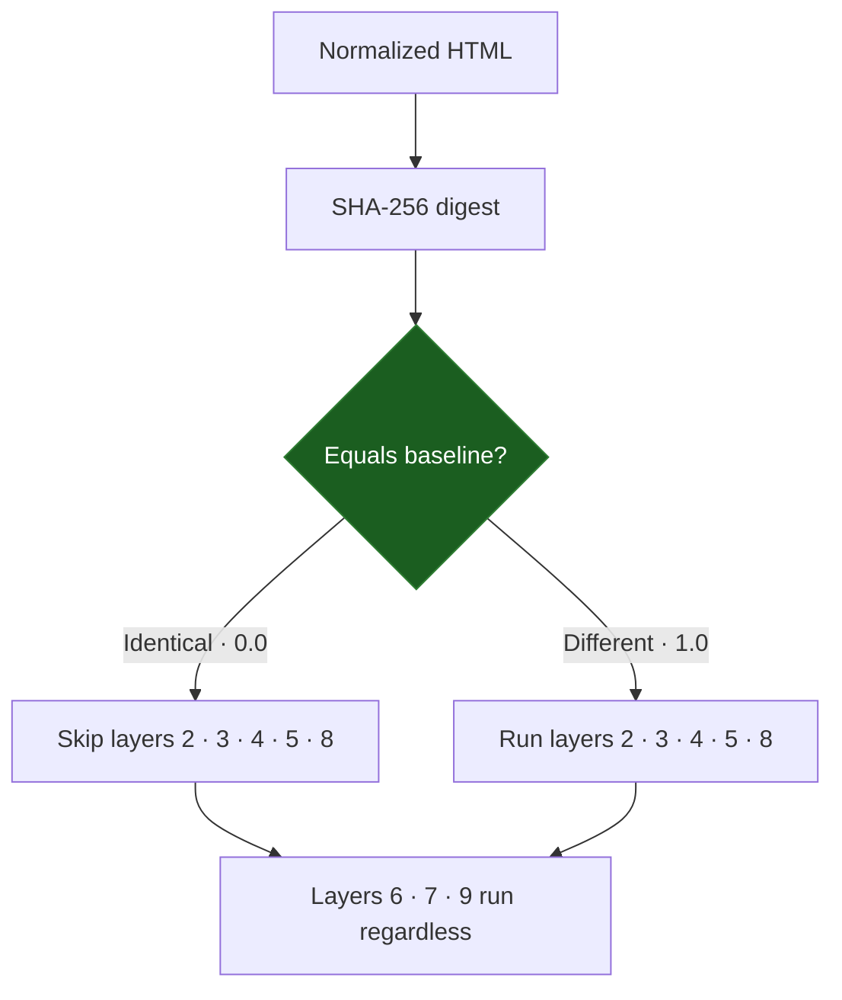

The **Content Hash Layer** is the first, fastest, and most fundamental layer in the pipeline. It performs a cryptographic comparison of the normalized HTML of the trusted baseline against the current scan. It answers one binary question — *did the bytes change at all?* — and that answer decides how much of the rest of the pipeline needs to run.

<Info>
  Source: `backend/worker/hashing.py` (`normalize_content`, `content_sha256`, `layer1_hash_diff`). The gating logic lives in `backend/worker/detection/pipeline.py`.
</Info>

## What this layer produces

| Property | Value |
| :--- | :--- |
| Stable key | `layer1_hash` |
| Algorithm | SHA-256 over normalized HTML |
| Score domain | Binary: `0.0` (identical) or `1.0` (any difference) |
| Runs on | The **original**, unsuppressed HTML — always |
| Gates | Layers 2, 3, 4, 5, 8 when identical |

A hash cannot grade *how much* a page changed — that is the job of the downstream layers. Layer 1 only reports change versus no-change, and it is deliberately the one signal suppression rules can never silence: the hash is a tamper-evidence anchor.

## Deep dive mechanism

<Steps>
  <Step title="Capture content">
    The Celery worker captures the page. The exact HTML that was stored when the baseline was frozen is compared against the HTML captured on this scan.
  </Step>
  <Step title="Normalize conservatively">
    Normalization removes only representation noise, never content. `normalize_content()` converts `\r\n` and `\r` to `\n`, right-strips every line, and strips leading and trailing blank lines. It does **not** collapse internal whitespace, lowercase, or reorder attributes — aggressive normalization would mask real defacement.

    ```python
    def normalize_content(html: str) -> str:
        lines = html.replace("\r\n", "\n").replace("\r", "\n").split("\n")
        normalized = "\n".join(line.rstrip() for line in lines)
        return normalized.strip("\n")
    ```
  </Step>
  <Step title="Digest">
    The normalized string is UTF-8 encoded (`errors="replace"`) and hashed with `hashlib.sha256()`.
  </Step>
  <Step title="Compare">
    If the current digest equals the baseline's stored `content_hash`, the layer emits `0.0`. Any difference emits `1.0`. The evidence records both digests and the `identical` flag.
  </Step>
</Steps>

<Note>
  Dynamic-content false positives (timestamps, session tokens, rotating widgets) are **not** handled by hashing less. They are handled by [suppression rules](/layers/9-risk-fusion#suppression-and-the-fused-score) that gate the downstream *scores*, while Layer 1 still faithfully reports that bytes changed.
</Note>

## Pipeline gating

Layer 1 is the pipeline's largest performance optimization. A byte-identical document cannot differ in its DOM tree, its links, its rendered pixels, its visible text, or its semantics — so an identical hash skips those layers entirely.



<AccordionGroup>
  <Accordion title="Skipped when identical" icon="ban">
    Defined in `pipeline.py` as `GATED_BY_IDENTICAL_HASH`:
    - **Layer 2** — DOM Structure
    - **Layer 3** — Link Audit
    - **Layer 4** — Visual Diff
    - **Layer 5** — Signatures
    - **Layer 8** — Semantics

    Skipped layers are not silently dropped. Each records a `skip_result` with score `None` and the reason *"gated by layer 1: content hash identical, layer cannot produce new signal"*, so the scan output always shows why a layer did not run.

    Layer 4 is included in the gate on purpose: a byte-identical page could only differ visually through non-deterministic rendering noise in the headless browser, which is exactly the false-positive class the gate exists to suppress.
  </Accordion>
  <Accordion title="Never skipped" icon="circle-check">
    - **Layer 6** (Security Metadata): TLS certificates and HTTP headers shift independently of the HTML payload.
    - **Layer 7** (Cloaking): per-User-Agent divergence is invisible to the primary content hash.
    - **Layer 9** (Risk Fusion): always runs. Gated layers contribute `0.0` to the feature vector and are marked `ran=False`.
  </Accordion>
</AccordionGroup>

<Warning>
  **Baseline artifact missing.** If the baseline's stored HTML artifact is unavailable (a moved volume or lost file) but its stored digest survives, Layer 1 can still hash-compare. In that case the content-comparing layers (2, 3, 5, 8) are skipped with the reason *"baseline HTML artifact unavailable — content comparison impossible"* rather than false-flagging everything against an empty baseline. Layer 4 still runs because it compares screenshots, not HTML.
</Warning>

## Evasion resistance

<Warning>
  **Evasion attempt:** an attacker injects a malicious script and deletes an equal number of benign bytes elsewhere to keep the file size identical.
</Warning>

SHA-256 is a cryptographic hash: matching a target digest by manipulating unrelated bytes is computationally infeasible. Changing a single bit anywhere in the normalized content produces a completely different digest, the gate opens, and layers 2–8 run. File size is irrelevant — the hash depends on content, not length.
