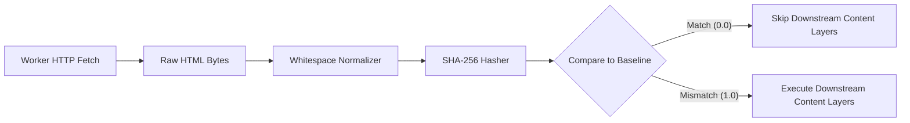

The **Content Hash Layer** is the first, fastest, and most fundamental layer in the Wardress detection pipeline. It performs a raw cryptographic comparison of the HTML bytes of the baseline against the current scan.

## Deep Dive Mechanism

The Wardress backend executes Layer 1 before instantiating any NLP models (`MiniLM`) or computer vision frameworks (`scikit-image`).

<Steps>
  <Step title="Fetch Content">
    The Celery worker fetches the target URL using `httpx`.
  </Step>
  <Step title="Normalize Bytes">
    The raw HTML string is normalized using Python's `re` module to collapse sequences of `\r`, `\n`, `\t`, and spaces into a single space. This prevents insignificant formatting changes (like an editor changing spaces to tabs) from breaking the hash.
  </Step>
  <Step title="Cryptographic Digest">
    The normalized bytes are hashed using the `hashlib.sha256()` algorithm.
  </Step>
  <Step title="Comparison">
    If the current scan's digest matches the `content_hash` in the active Baseline database record, Layer 1 emits a score of `0.0`. If it differs, it emits a score of `1.0`.
  </Step>
</Steps>

## Pipeline Gating (The Fail-Safe Bypass)

Layer 1 acts as a massive performance optimization via **gating**. Because a byte-identical HTML document cannot possibly differ in its DOM tree, external links, visual rendering, or textual semantics, an identical hash automatically skips several downstream layers.

<AccordionGroup>
  <Accordion title="Layers Skipped (If Identical)">
    These layers are hardcoded in `pipeline.py` within the `GATED_BY_IDENTICAL_HASH` set:
    - **Layer 2** (DOM Structure)
    - **Layer 3** (Link Audit)
    - **Layer 4** (Visual Diff)
    - **Layer 5** (Signatures)
    - **Layer 8** (Semantics)
    
    *Note: Layer 4 is skipped because a byte-identical page can only differ visually due to non-deterministic rendering noise in the headless browser. The gate actively suppresses this false positive.*
  </Accordion>
  <Accordion title="Layers Never Skipped">
    - **Layer 6** (Security Metadata): TLS certificates and HTTP headers can shift entirely independently of the HTML payload.
    - **Layer 7** (Cloaking): Bot-specific User-Agent variations are completely invisible to the baseline desktop fetch.
    - **Layer 9** (Risk Fusion): The Scikit-Learn logistic regression model always executes. The skipped layers simply contribute `0.0` to the feature vector.
  </Accordion>
</AccordionGroup>

## Evasion Mitigation

<Warning>
  **Evasion Attempt**: An attacker tries to defeat the hash by injecting a malicious script and simultaneously deleting an equivalent number of benign bytes elsewhere to keep the file size identical.
</Warning>

**Mitigation**: Wardress uses SHA-256, a cryptographic hash function resistant to collision attacks. It is computationally infeasible for an attacker to manipulate the file bytes to intentionally reproduce the same baseline hash digest. If a single bit is altered by an injection, the hash completely diverges, the gate opens, and layers 2-8 execute immediately.
