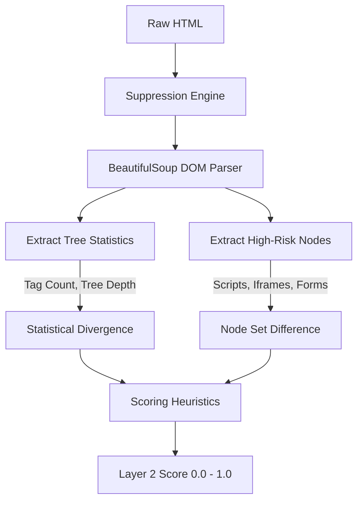

The **DOM Structure Layer** inspects the underlying HTML tree of the page, completely independent of how it visually renders in the browser. Defacements often rely on injecting hidden elements, malicious scripts, or overriding style attributes to hide the original content.

## Architecture



## Deep Dive Mechanism

Layer 2 receives the **Suppression-Filtered** copy of the HTML. It parses the document into a tree using Python's `BeautifulSoup4` library and evaluates several structural heuristics:

<AccordionGroup>
  <Accordion title="Tree Depth & Element Counts">
    Massive shifts in the total number of HTML tags or the depth of the document tree indicate a severe rewrite or replacement of the page. If the baseline has 1,500 elements and a depth of 12, and the current scan drops to 30 elements and a depth of 3, the page structure has been gutted (a classic signature of a full defacement).
  </Accordion>
  <Accordion title="Script Tag Injections">
    The parser isolates all `<script>` nodes. It compares the `src` attributes and the inline script content hashes. Newly added scripts—especially those loading external resources not present in the baseline—heavily penalize the score.
  </Accordion>
  <Accordion title="Iframe Hijacks">
    Attackers frequently use hidden or absolutely-positioned `<iframe>` tags to overlay malicious content (clickjacking) or mine cryptocurrency silently. Layer 2 explicitly isolates and tracks iframe insertions.
  </Accordion>
  <Accordion title="Style Overrides">
    Detects inline `style=""` attributes that force structural elements to `display: none` or `visibility: hidden` unexpectedly. Defacers often use this to hide the original site without deleting the code, ensuring their massive injected image takes focus.
  </Accordion>
</AccordionGroup>

## False Positive Suppression

If an operator defines a CSS Selector suppression rule (e.g., `#visitor-counter`), the `Suppression Engine` actively strips that subtree from *both* the baseline and the current scan *before* the DOM parser builds the tree. 

This ensures that a dynamic widget adding child elements every second does not artificially inflate the structural risk score.

<CodeGroup>
```html Baseline (Stripped)
<body>
  <div id="hero">Welcome</div>
  <!-- #visitor-counter removed by suppression engine -->
</body>
```

```html Current (Stripped)
<body>
  <div id="hero">Welcome</div>
  <!-- #visitor-counter removed by suppression engine -->
</body>
```
</CodeGroup>

## Evasion Mitigation

<Warning>
  **Evasion Attempt**: An attacker injects a malicious payload into an existing `<script>` tag by appending code to the end of a benign, minified jQuery library.
</Warning>

**Mitigation**: The DOM Structure layer hashes the exact text content of every inline script. Even if the DOM tree shape and element counts remain exactly identical, the hash of the injected script tag diverges from the baseline, driving the layer score up.
