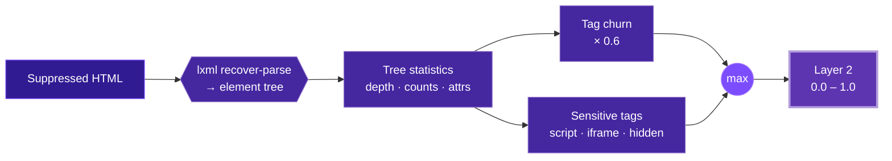

The **DOM Structure Layer** inspects the tag tree of the page, independent of how it renders. Defacements frequently inject hidden elements, add `<script>` or `<iframe>` nodes, or gut the original markup — all of which show up as structural deltas even when the visual layout is manipulated to hide them.

<Info>
  Source: `backend/worker/detection/dom.py` (`layer2_dom_structure`, `_tree_stats`, `parse_html`). Input: the suppression-filtered HTML of both sides.
</Info>

## Parsing: lxml with recovery

Layer 2 parses with **lxml's** `HTMLParser(recover=True)`, not BeautifulSoup. libxml2 recovers from arbitrarily broken markup without raising, so a malformed page never crashes the layer. A page that produces no tree at all (for example an empty string) is reported in evidence rather than raised.

```python
parser = lxml_html.HTMLParser(recover=True)
root = lxml_html.document_fromstring(text, parser=parser)
```

If **both** sides fail to parse, the layer returns `0.0` with a note. If **one** side parses and the other does not, that is treated as a drastic change and scored `1.0`.

## Deep dive mechanism



The layer walks the tree once and extracts a statistics bundle for each side: total element count, maximum depth, per-tag counts, and dedicated counts for `<script>`, `<iframe>`, and hidden elements. It then computes two scores and takes the larger.

<AccordionGroup>
  <Accordion title="Structural churn" icon="chart-column">
    From the per-tag `Counter`s, the layer computes how many tag instances were added and removed. Churn is `sum(added) + sum(removed)`, saturating against half the tree:

    ```python
    churn_score = min(1.0, churn / (0.5 * total))
    ```

    where `total = max(baseline_elements, current_elements, 1)`. Roughly half the tree changing drives `churn_score` to `1.0`. This term is then weighted by `0.6` in the final score, so pure structural churn alone caps its contribution at `0.6`.
  </Accordion>
  <Accordion title="Sensitive-tag deltas" icon="triangle-exclamation">
    New `<script>`, `<iframe>`, and hidden elements get a dedicated boost — one injected script on a 1,000-element page is negligible churn but a serious signal. Their combined increase saturates through an exponential:

    ```python
    sensitive = new_scripts + new_iframes + new_hidden
    sensitive_score = 1 - math.exp(-0.7 * sensitive)
    ```

    A single new sensitive element yields ≈ 0.50; two yields ≈ 0.75; three ≈ 0.88.
  </Accordion>
  <Accordion title="Hidden-element detection" icon="eye-slash">
    An element counts as hidden if it carries the `hidden` attribute, or its inline `style` contains `display:none` / `display: none` / `visibility:hidden` / `visibility: hidden` (whitespace-insensitive). Defacers use hidden containers to stage injected content or overlay the original page.
  </Accordion>
</AccordionGroup>

The final score is:

```python
score = max(churn_score * 0.6, sensitive_score)
```

Maximum tree-depth delta is recorded in evidence for context but does not directly drive the score.

## Evidence recorded

The findings row includes baseline and current element counts, the top added and removed tags (capped at 50 items), script / iframe / hidden counts for both sides, the max-depth delta, and the raw structural churn. When suppression content rules applied, a `suppression_applied` summary is attached.

## False-positive suppression

Layer 2 receives the **suppression-filtered** copy of both pages. If an operator defines a CSS-selector rule (for example `#visitor-counter`), the matching subtree is dropped from *both* baseline and current via lxml `drop_tree()` before the tree is analyzed — so a widget that adds child nodes every second does not inflate structural risk.

<CodeGroup>
```html Baseline (filtered)
<body>
  <div id="hero">Welcome</div>
  <!-- #visitor-counter dropped by suppression -->
</body>
```

```html Current (filtered)
<body>
  <div id="hero">Welcome</div>
  <!-- #visitor-counter dropped by suppression -->
</body>
```
</CodeGroup>

## What this layer does and does not do

<Warning>
  **Common misconception:** Layer 2 does *not* hash the text content of individual inline `<script>` tags. It counts scripts and diffs tag-set structure. A payload appended inside an existing inline script with no change to tag counts is caught by the [Content Hash](/layers/1-content-hash) (the bytes changed, opening the gate) and, if it introduces a new external domain, by [Link Audit](/layers/3-link-audit) and the fusion model — not by a per-script content hash here.
</Warning>
