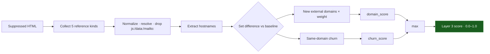

The **Link Audit Layer** diffs the *sets* of external references embedded in the page. Attackers redirect form submissions to phishing endpoints, inject third-party `<script>` sources, or add unauthorized tracking. A brand-new external domain appearing on a page is one of the strongest injection signals, and this layer isolates it statically without executing anything.

<Info>
  Source: `backend/worker/detection/dom.py` (`layer3_link_audit`, `_collect_refs`, `_norm_ref`, `_domains`). Input: the suppression-filtered HTML of both sides.
</Info>

## References collected

The layer extracts five reference kinds. Note that `` is **not** among them — image sources are a high-noise, low-signal channel and are covered visually by [Layer 4](/layers/4-visual-diff).

| Reference kind | Source | Weight |
| :--- | :--- | :---: |
| `script_src` | `<script src>` | 1.0 |
| `iframe_src` | `<iframe src>` | 1.0 |
| `form_action` | `<form action>` | 1.0 |
| `link_href` | `<link href>` (stylesheets, fonts) | 0.6 |
| `a_href` | `<a href>` (hyperlinks) | 0.35 |

A new external domain in a `<script>`, `<iframe>`, or `<form action>` is treated as critical; the same domain appearing only in an `<a href>` is weighted lowest.

## Deep dive mechanism



<Steps>
  <Step title="Extraction">
    lxml walks the tree and collects `src`/`href`/`action` for the five tag kinds into sets.
  </Step>
  <Step title="Normalization">
    Each reference is resolved against the page's `final_url` with `urljoin`, then normalized. References that are not comparable links are dropped: fragments (`#...`), and `javascript:`, `data:`, `mailto:`, `tel:`, `about:` schemes. Only `http`, `https`, and scheme-relative refs survive. Fragments are stripped from the tail; **query strings are kept** (defacers love appending `?redirect=`).
  </Step>
  <Step title="Known-domain set">
    The baseline's domains across all reference kinds, plus the page's own host, form the `known_domains` set. Any added reference whose hostname is not in that set is a *new external domain*.
  </Step>
  <Step title="Scoring">
    New external domains are weighted by kind and saturated; same-domain churn is scored separately and far more gently. The layer returns the larger of the two.
  </Step>
</Steps>

### Scoring formulas

```python
# weighted count of new external domains, per reference kind
domain_score = 1 - math.exp(-0.9 * new_domains_weighted)   # saturating
# every added ref (even same-domain) matters a little, capped at 0.4
churn_score  = min(0.4, 0.02 * total_new_refs)
score        = max(domain_score, churn_score)
```

One new script/iframe/form domain (weight 1.0) yields `domain_score ≈ 0.59`; two yield ≈ 0.83. Same-domain reorganization can never exceed `0.4` from this layer.

## Traffic-hijacking examples

<CardGroup cols={2}>
  <Card title="Credential harvesting" icon="mask">
    An attacker rewrites `<form action="/login">` to `https://evil.com/capture`. `evil.com` is a new domain in a `form_action` (weight 1.0) and spikes the score immediately.
  </Card>
  <Card title="Malvertising / cryptomining" icon="rectangle-ad">
    An injected `<script src="https://crypto-miner.io/miner.js">` surfaces `crypto-miner.io` as a new `script_src` domain regardless of obfuscation inside the file.
  </Card>
</CardGroup>

## False-positive suppression

Layer 3 receives the suppression-filtered HTML. CSS-selector rules applied to a dynamic widget that loads external pixels strip those references from the DOM on both sides before extraction.

<Info>
  **Internal restructuring is free.** Moving links, renaming paths, or swapping assets within already-trusted domains scores `0.0` from the domain term. Changing `cdn.yoursite.com/img1.png` to `cdn.yoursite.com/img2.png` introduces no new domain; only a small `churn_score` (capped at 0.4) can register, and only if the total number of added references is large.
</Info>
