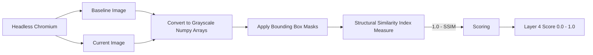

The **Visual Diff Layer** evaluates what the user actually sees. Some defacements bypass the DOM and semantic layers by simply uploading a massive image that covers the entire screen (an image-based defacement). Layer 4 catches this immediately.

## Deep Dive Mechanism

Wardress utilizes a headless Chromium instance (orchestrated via Playwright inside the Celery worker) to capture a full-page screenshot of the target site. The baseline screenshot is compared against the current screenshot using the `scikit-image` computer vision library.

<Steps>
  <Step title="Image Normalization">
    Both images are decoded and converted to grayscale `numpy` arrays. This removes false positives caused by minor color banding or anti-aliasing artifacts that occur between browser rendering passes.
  </Step>
  <Step title="Masking (BBox Suppression)">
    If the operator has defined any Bounding Box (`bbox`) suppression rules (e.g., hiding a cycling ad banner), those specific coordinate regions are overwritten with pure black pixels `(0, 0, 0)` on *both* arrays. The regions are mathematically excluded from structural variance.
  </Step>
  <Step title="Structural Similarity Index (SSIM)">
    The images are compared using the SSIM algorithm. Unlike raw pixel-by-pixel Euclidean distance calculations (which fail disastrously if a layout shifts by a single pixel), SSIM mimics human visual perception by measuring changes in structural information, luminance, and contrast over localized image windows.
  </Step>
  <Step title="Scoring">
    The resulting SSIM is a float between `0.0` and `1.0`, where `1.0` means perfectly identical. Wardress inverts this (`1.0 - SSIM`) so the output aligns with the risk scale: a score of `0.0` means visually identical; `1.0` means entirely different.
  </Step>
</Steps>

## Bounding Box Rules

Because visual rendering is highly sensitive (even a 1px shift in a font rendering engine can trigger a minor difference), Wardress allows operators to draw boxes over dynamic regions via the dashboard.

These rules are stored in the database as normalized fractions `(x, y, w, h)` (e.g., `0.1, 0.2, 0.5, 0.1`). 

<Warning>
  **Resolution Independence**: Because the boxes are stored as fractions rather than absolute pixel coordinates, they are resolution-independent. If the site dynamically grows vertically and is captured at a different total height tomorrow, the masked region proportionally scales to cover the exact same relative area.
</Warning>
