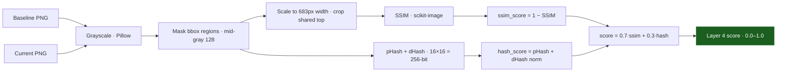

The **Visual Diff Layer** evaluates what a visitor actually sees. Image-based defacements bypass the DOM and semantic layers by covering the page with a single large image; a subtle overlay can change the rendered result without much structural churn. Layer 4 compares full-page screenshots three ways and fuses the results.

<Info>
  Source: `backend/worker/detection/visual.py` (`layer4_visual_diff`). Screenshots are captured by Playwright/Chromium in the worker; comparison uses `scikit-image` (SSIM) and `imagehash` (pHash + dHash).
</Info>

## Three measurements, one score



<Steps>
  <Step title="Grayscale decode">
    Both PNGs are decoded with Pillow and converted to grayscale (`convert("L")`). This removes false positives from minor color banding and anti-aliasing between render passes. An unreadable or absent screenshot on either side is a content problem, not a crash: the layer returns `0.0` with a note and the other eight layers still run.
  </Step>
  <Step title="Bounding-box masking">
    Any `bbox` suppression regions are filled with a uniform **mid-gray (value 128)** — not black — on a copy of both images, *before* any comparison. Both SSIM and the perceptual hashes see the mask. Coordinates are resolved against the **baseline** capture geometry (the image the operator drew on) and scaled to the current image through the width ratio.
  </Step>
  <Step title="Align for SSIM">
    Full-page captures of the same site legitimately differ in height (a new post pushes the footer down). Both images are scaled to a common `COMPARE_WIDTH` of **683px** (half the 1366px capture viewport), then cropped to the shorter of the two heights (bounded at 4096px). SSIM therefore compares the shared top region; the whole-image perceptual hashes still see the tails.
  </Step>
  <Step title="SSIM">
    `structural_similarity` runs on the aligned grayscale arrays with `data_range=255.0` passed explicitly (the skimage docs warn the float estimate is otherwise wrong). SSIM ≈ 1.0 means structurally identical.
  </Step>
  <Step title="Perceptual hashes">
    `imagehash.phash` and `imagehash.dhash` run at `hash_size=16` (a 256-bit hash, finer than the default 64-bit). Hamming distance is normalized by the 256 bits. These are robust to compression and minor rendering noise and corroborate the SSIM signal.
  </Step>
</Steps>

### Final score

```python
ssim_score = max(0.0, min(1.0, 1.0 - ssim))
hash_score = max(0.0, min(1.0, phash_dist + dhash_dist))   # each realistically ≤ 0.5
score      = 0.7 * ssim_score + 0.3 * hash_score
```

SSIM dominates (weight 0.7) because it perceives layout structure; the perceptual-hash distance (weight 0.3) confirms whole-page change. A score of `0.0` means visually identical; `1.0` means entirely different.

<Note>
  Because SSIM mimics human visual perception over localized windows — measuring luminance, contrast, and structure rather than raw per-pixel Euclidean distance — it does not collapse when the layout shifts by a single pixel, unlike naive pixel differencing.
</Note>

## Evidence recorded

The findings row stores the raw `ssim` value, pHash and dHash distances in both bits and normalized form, the hash bit count, baseline and current image sizes, the compared size, and the list of suppressed regions when any were applied.

## Bounding-box rules

Operators draw boxes over dynamic regions (cycling banners, live tickers) in the dashboard. Rules are stored as normalized fractions `x,y,w,h` in `[0,1]` of the baseline capture.

<Warning>
  **Resolution and height independence.** Because boxes are fractions of the baseline geometry and applied through the width ratio, they stay pinned to the same content even when the current capture grows taller. Scaling the vertical axis by each image's own height would drift the mask down a longer page — the layer deliberately avoids that.
</Warning>
