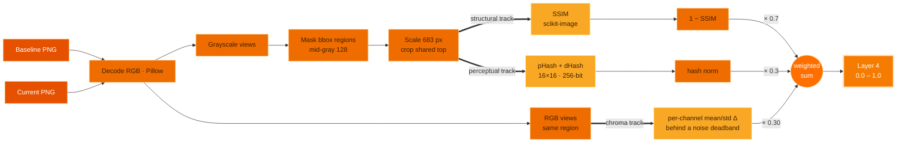

The **Visual Diff Layer** evaluates what a visitor actually sees. Image-based defacements bypass the DOM and semantic layers by covering the page with a single large image; a subtle overlay can change the rendered result without much structural churn. Layer 4 compares full-page screenshots four ways and fuses the results.

<Info>
  Source: `backend/worker/detection/visual.py` (`layer4_visual_diff`). Screenshots are captured by Playwright/Chromium in the worker; comparison uses `scikit-image` (SSIM), `imagehash` (pHash + dHash), and per-channel RGB statistics for the chroma term.
</Info>

## Four measurements, one score


```mermaid actions={true}
flowchart LR
    BS["Baseline PNG"]:::in --> DC
    CS["Current PNG"]:::in --> DC["Decode RGB · Pillow"]:::node
    DC --> GL["Grayscale views"]:::node
    GL --> MK["Mask bbox regions<br/>mid-gray 128"]:::node
    MK --> RS["Scale 683 px<br/>crop shared top"]:::node
    DC --> CR["RGB views<br/>same region"]:::node
    RS ==>|"structural track"| SSIM["SSIM<br/>scikit-image"]:::track
    RS ==>|"perceptual track"| PH["pHash + dHash<br/>16×16 · 256-bit"]:::track
    CR ==>|"chroma track"| CH["per-channel mean/std Δ<br/>behind a noise deadband"]:::track
    SSIM --> SS["1 − SSIM"]:::node
    PH --> HS["hash norm"]:::node
    SS -->|"× 0.7"| F(("weighted<br/>sum")):::pick
    HS -->|"× 0.3"| F
    CH -->|"× 0.30"| F
    F --> OUT["Layer 4<br/>0.0 – 1.0"]:::out

    classDef in fill:#e65100,stroke:#ffb74d,color:#fff;
    classDef node fill:#ef6c00,stroke:#ffcc80,color:#3b1f00;
    classDef track fill:#f9a825,stroke:#fff59d,color:#3b1f00;
    classDef pick fill:#ff6f00,stroke:#ffe082,color:#fff;
    classDef out fill:#f57c00,stroke:#ffe0b2,color:#fff,stroke-width:3px;
```

<Steps>
  <Step title="Decode to RGB, derive grayscale">
    Both PNGs are decoded with Pillow and converted to **RGB**; grayscale views are then derived from them. The luminance channel drives SSIM and the perceptual hashes (removing false positives from minor color banding between render passes), while the full-color views feed only the chroma-shift term below.
  </Step>
  <Step title="Degraded captures are not zeros">
    An unreadable or absent screenshot on either side is a capture problem, not a measurement: the layer returns a **degraded** result (`score: null`, `degraded: true`) and the other layers still run. Fusion treats the visual channel as *unknown* rather than silently reading it as "pixels identical".
  </Step>
  <Step title="Bounding-box masking">
    Any `bbox` suppression regions are filled with a uniform **mid-gray (value 128)** — not black — on a copy of both images, *before* any comparison. SSIM, the perceptual hashes, and the chroma term all see the mask. Coordinates are resolved against the **baseline** capture geometry (the image the operator drew on) and scaled to the current image through the width ratio.
  </Step>
  <Step title="Align for SSIM">
    Full-page captures of the same site legitimately differ in height (a new post pushes the footer down). Both images are scaled to a common `COMPARE_WIDTH` of **683px** (half the 1366px capture viewport), then cropped to the shorter of the two heights (bounded at 4096px). SSIM therefore compares the shared top region; the whole-image perceptual hashes still see the tails.
  </Step>
  <Step title="SSIM">
    `structural_similarity` runs on the aligned grayscale arrays with `data_range=255.0` passed explicitly (the skimage docs warn the float estimate is otherwise wrong). SSIM ≈ 1.0 means structurally identical.
  </Step>
  <Step title="Perceptual hashes">
    `imagehash.phash` and `imagehash.dhash` run at `hash_size=16` (a 256-bit hash, finer than the default 64-bit). Hamming distance is normalized by the 256 bits. These are robust to compression and minor rendering noise and corroborate the SSIM signal.
  </Step>
  <Step title="Chroma shift">
    Over the same shared top region, the layer computes the largest per-channel difference of the RGB means and standard deviations between the two captures. A deadband of **2.0** (0–255 units) keeps render noise (~1 unit) silent; anything past it scales toward 1.0 and contributes at weight **0.30**. This is the channel that sees hue-only defacement — recolored banners or overlays that preserve luminance almost exactly — which pure luminance metrics barely register. A maximal chroma-only change contributes at most 0.30 on its own: visible, never single-handedly flag-worthy (legitimate brand refreshes look pixel-wise like hostile recolors, so corroboration from the content layers or rule floors is what separates them).
  </Step>
</Steps>

### Final score

```python
ssim_score   = max(0.0, min(1.0, 1.0 - ssim))
hash_score   = max(0.0, min(1.0, phash_dist + dhash_dist))   # each realistically ≤ 0.5
chroma_score = clamp((max(mean_Δ, std_Δ) - 2.0) / (255.0 - 2.0))
score        = min(1.0, 0.7 * ssim_score + 0.3 * hash_score + 0.30 * chroma_score)
```

SSIM dominates (weight 0.7) because it perceives layout structure; the perceptual-hash distance (weight 0.3) confirms whole-page change; the chroma term (weight 0.30, additive) adds the hue evidence luminance cannot see. A score of `0.0` means visually identical; `1.0` means entirely different. In practice a pure hue-only recolor lands around **0.15–0.20** — an honest "the pixels changed" reading that flips the verdict to `changed`, deliberately below what fusion would flag on this channel alone.

<Note>
  Because SSIM mimics human visual perception over localized windows — measuring luminance, contrast, and structure rather than raw per-pixel Euclidean distance — it does not collapse when the layout shifts by a single pixel, unlike naive pixel differencing.
</Note>

## Evidence recorded

The findings row stores the raw `ssim` value, pHash and dHash distances in both bits and normalized form, the hash bit count, the chroma deltas (`chroma_mean_delta_255`, `chroma_std_delta_255`), baseline and current image sizes, the compared size, and the list of suppressed regions when any were applied.

## Bounding-box rules

Operators draw boxes over dynamic regions (cycling banners, live tickers) in the dashboard. Rules are stored as normalized fractions `x,y,w,h` in `[0,1]` of the baseline capture.

<Warning>
  **Resolution and height independence.** Because boxes are fractions of the baseline geometry and applied through the width ratio, they stay pinned to the same content even when the current capture grows taller. Scaling the vertical axis by each image's own height would drift the mask down a longer page — the layer deliberately avoids that.
</Warning>
