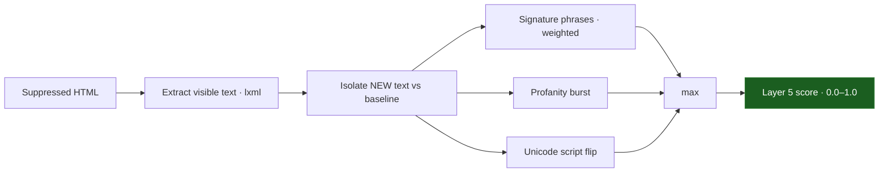

The **Signatures Layer** is a fast, rule-based scanner for the "calling cards" of defacement campaigns. It runs on the visible text that is **new** relative to the baseline, so a security blog that always discussed these topics never flags on every scan.

<Info>
  Source: `backend/worker/detection/signatures.py` (`layer5_signatures`, `extract_visible_text`, `_new_text`, `script_profile`). Pure standard-library `re` and `unicodedata` — no model load, executes in milliseconds.
</Info>

## Three independent signals



Visible text is extracted from the lxml tree, excluding `<script>`, `<style>`, `<noscript>`, and `<template>` nodes (with a tag-stripping regex fallback if no DOM builds). The baseline and current texts are split into lines and sentences; only pieces present now but absent from the baseline feed the signature and profanity checks.

### 1. Signature phrases (weighted tiers)

Matches use pre-compiled regexes across three weight tiers. The matched weights are summed and clamped to `1.0`.

| Tier | Weight | Examples |
| :--- | :---: | :--- |
| Strong | 1.0 | `hacked by`, `owned by`, `pwned by`, `defaced by`, `h4ck3d`, `<crew> ... hacked/owned/defaced` |
| Medium | 0.55 | `security breached`, `greetz` / `gr33tz`, `we are anonymous`, `expect us`, `you have been hacked` |
| Weak | 0.25 | `h4ck3r`, `killswitch`, `rooted access`, `admin panel breached`, `sql injection`, `zeroday` |

```python
signature_score = min(1.0, weight_sum)
```

A single strong phrase is conclusive on its own; a lone weak keyword needs corroboration.

### 2. Profanity burst

A curated profanity lexicon (matched with elongation tolerance, e.g. `fuuuck`) is counted on the new text. The score is graded and capped so a single swear never dominates:

```python
profanity_score = min(0.6, 0.25 * len(profanity_hits))
```

### 3. Unicode script flip

`script_profile()` buckets alphabetic characters into coarse Unicode scripts (Latin, Arabic, Cyrillic, Han/CJK, Hangul, and more). A flip is flagged only when both sides have a *clear* dominant script and it changed:

```python
script_flip = (b_dom != c_dom) and b_frac >= 0.6 and c_frac >= 0.6
flip_score  = 0.7 if script_flip else 0.0
```

A predominantly Latin page suddenly dominated by Cyrillic or Arabic is a well-documented mass-defacement characteristic. Requiring ≥ 0.6 dominance on *both* sides avoids flagging pages that are naturally mixed-script.

### Final score

```python
score = max(signature_score, profanity_score, flip_score)
```

## The "new text only" rule

Layer 5 scores only text absent from the baseline. `_new_text()` builds a set of baseline lines and sentences, then keeps current pieces that appear in neither.

<Info>
  This is what lets a cybersecurity blog discussing "how sites get hacked by attackers", or a geopolitical news site, coexist with the signature scanner: any phrase that was already in the trusted baseline is implicitly whitelisted and ignored on every subsequent scan.
</Info>

## Evidence recorded

Signature matches (pattern, matched text, weight), the weight sum, profanity matches, the script-flip flag, dominant scripts and full script profiles for both sides, and the new-text character count — all capped to keep the findings row bounded.

<Tip>
  **Layer 5 vs Layer 8.** Layer 5 is exact-match and instant; [Layer 8](/layers/8-semantics) shares this text-extraction and new-text logic but adds neural semantic drift and a graded aggression lexicon for meaning-level changes that exact matching misses.
</Tip>
