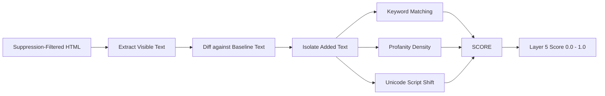

The **Signatures Layer** acts as a fast, rule-based text scanner. It targets the "calling cards" of script kiddies and hacktivist groups by analyzing only the newly added, visible text on the page.

## Deep Dive Mechanism

This layer specifically targets classic vandalism. It strips all HTML markup, scripts, CSS, and metadata, leaving only the human-readable text. It then performs a diff against the baseline text to isolate the *newly added* sentences.

These new sentences are evaluated against several distinct heuristics:

<AccordionGroup>
  <Accordion title="Defacement Keywords">
    Scans for classic bragging phrases using pre-compiled regular expressions (e.g., `"hacked by"`, `"owned by"`, `"pwned"`, `"security is an illusion"`). Matches immediately drive the layer score heavily toward `1.0`.
  </Accordion>
  <Accordion title="Profanity & Aggression Density">
    Counts the frequency of profanity or highly aggressive terms using an internal lexicon. A single swear word on a forum might be benign, but a sudden, massive spike in profanity density is a strong indicator of compromise.
  </Accordion>
  <Accordion title="Unicode Script Shifts">
    Analyzes the dominant Unicode script of the new text using `unicodedata`. If a site that historically uses 99% Latin characters suddenly injects massive blocks of Cyrillic, Arabic, or Han characters, this layer flags a severe linguistic anomaly.
  </Accordion>
</AccordionGroup>

## False Positive Suppression (The "New Text" Extraction)

To prevent false alarms on sites that legitimately contain these keywords (e.g., a cybersecurity blog discussing "how sites are hacked by attackers" or a geopolitical news site), Layer 5 *only* scores text that was **not present in the baseline**. 

If the baseline already contained the word "hacked", it is considered implicitly trusted and is ignored in subsequent scans.

<Info>
  **Performance Optimization**: Because this layer relies on compiled regex and simple Unicode evaluation, it executes in milliseconds. It provides an immediate, high-confidence signal for blatant defacements without requiring the heavy NLP overhead of Layer 8.
</Info>
