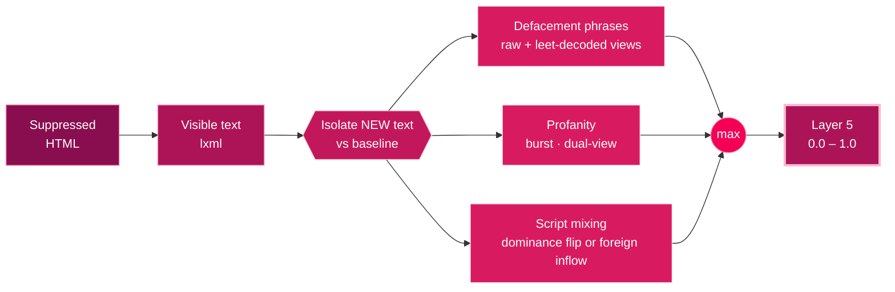

The **Signatures Layer** is a fast, rule-based scanner for the "calling cards" of defacement campaigns. It runs on the visible text that is **new** relative to the baseline, so a security blog that always discussed these topics never flags on every scan.

<Info>
  Source: `backend/worker/detection/signatures.py` (`layer5_signatures`, `extract_visible_text`, `_new_text`, `script_profile`). Pure standard-library `re` and `unicodedata` — no model load, executes in milliseconds.
</Info>

## Three independent signals


```mermaid actions={true}
flowchart LR
    HTML["Suppressed<br/>HTML"]:::in --> VT["Visible text<br/>lxml"]:::node
    VT --> NT{{"Isolate NEW text<br/>vs baseline"}}:::gate
    NT --> SIG["Defacement phrases<br/>raw + leet-decoded views"]:::probe
    NT --> PR["Profanity<br/>burst · dual-view"]:::probe
    NT --> SF["Script mixing<br/>dominance flip or foreign inflow"]:::probe
    SIG & PR & SF --> M(("max")):::pick
    M --> OUT["Layer 5<br/>0.0 – 1.0"]:::out

    classDef in fill:#880e4f,stroke:#f06292,color:#fff;
    classDef node fill:#ad1457,stroke:#f48fb1,color:#fff;
    classDef gate fill:#c2185b,stroke:#f8bbd0,color:#fff;
    classDef probe fill:#d81b60,stroke:#fce4ec,color:#fff;
    classDef pick fill:#f50057,stroke:#ff80ab,color:#fff;
    classDef out fill:#ad1457,stroke:#f8bbd0,color:#fff,stroke-width:3px;
```

Visible text is extracted from the lxml tree, excluding `<script>`, `<style>`, `<noscript>`, and `<template>` nodes (with a tag-stripping regex fallback if no DOM builds). The baseline and current texts are split into lines and sentences; only pieces present now but absent from the baseline feed the signature and profanity checks.

### 1. Signature phrases (weighted tiers, leet-decoded)

Matches use pre-compiled regexes across three weight tiers. Every pattern runs against the raw new text **and** a conservative leetspeak decoding of it (`@`/`4`→a, `3`→e, `0`→o, `1`→i, `5`/`$`→s, `7`→t), so routine defacement spellings like `H@CK3D BY`, `PWN3D BY`, or `0WNED` cannot slip through. Matches are span-deduplicated across the two views (the decoding is length-preserving, so spans align), duplicate terms seen through both views count once, and the evidence always quotes the **original page spelling** verbatim. The matched weights are summed and clamped to `1.0`.

| Tier | Weight | Examples |
| :--- | :---: | :--- |
| Strong | 1.0 | `hacked by`, `owned by`, `pwned by`, `defaced by`, `h4ck3d`, `… was here … hacker/crew`, `cyber/dark army/team … hacked/owned/defaced` |
| Medium | 0.55 | `security breached`, `greetz` / `gr33tz`, `we are anonymous`, `expect us`, `you have been hacked` |
| Weak | 0.25 | `hacker` / `h4ck3r`, `killswitch`, `rooted access`, `admin panel breached`, `sql injection`, `zeroday` |

```python
signature_score = min(1.0, weight_sum)
```

A single strong phrase is conclusive on its own; a lone weak keyword needs corroboration.

### 2. Profanity burst

A curated profanity lexicon (matched with elongation tolerance, e.g. `fuuuck`, through the same dual-view matching so `$h1t`-style spellings register) is counted on the new text. The score is graded and capped so a single swear never dominates:

```python
profanity_score = min(0.6, 0.25 * len(profanity_hits))
```

### 3. Script mixing — two complementary rules

`script_profile()` buckets alphabetic characters into coarse Unicode scripts (Latin, Arabic, Cyrillic, Han/CJK, Hangul, and more) and profiles the **full** visible text of each side by default — no sampling cap stands between the rules and content anywhere on the page.

**Dominance flip** — the classic whole-page takeover signal:

```python
script_flip = (b_dom != c_dom) and b_frac >= 0.6 and c_frac >= 0.6
```

**New-script inflow** — catches partial takeovers that leave the page majority-Latin but inject a foreign-script banner (which produce zero dominance signal). All three gates must hold before it fires:

```python
# baseline established enough to call a script "absent" (≥ 40 alpha chars,
# foreign share < 0.01 there); the NEW text carries ≥ 40 foreign characters
# (an absolute grace — a name or stray quote never fires); and that mass is
# at least 5% of the whole current page.
script_inflow = bool(scripts_added) and added_chars >= 40 and page_share >= 0.05
```

Either rule sets the script slot:

```python
flip_score = 0.7 if (script_flip or script_inflow) else 0.0
```

Requiring clear dominance on *both* sides (for the flip) and an absolute + proportional mass (for the inflow) avoids flagging pages that are naturally mixed-script or that merely pick up a stray foreign quotation.

### Final score

```python
score = max(signature_score, profanity_score, flip_score)
```

## The "new text only" rule

Layer 5 scores only text absent from the baseline. `_new_text()` builds a set of baseline lines and sentences, then keeps current pieces that appear in neither.

<Info>
  This is what lets a cybersecurity blog discussing "how sites get hacked by attackers", or a geopolitical news site, coexist with the signature scanner: any phrase that was already in the trusted baseline is implicitly whitelisted and ignored on every subsequent scan.
</Info>

## Evidence recorded

Signature matches (pattern, matched text quoted verbatim from the page, weight), the weight sum, profanity matches, both script flags plus dominant scripts and full script profiles for both sides, and the new-text character count. Inflow diagnostics are recorded additively: `scripts_added` (which scripts were effectively absent from the baseline and appeared), `new_script_chars`, `new_script_page_share`, and the boolean `script_inflow` — all capped to keep the findings row bounded.

<Tip>
  **Layer 5 vs Layer 8.** Layer 5 is exact-match and instant; [Layer 8](/layers/8-semantics) shares this text-extraction and new-text logic but adds neural semantic drift and a graded aggression lexicon for meaning-level changes that exact matching misses.
</Tip>
