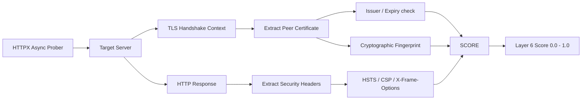

The **Security Metadata Layer** runs entirely independent of the page's HTML body. It focuses on the network transport and server configuration. Even if the `layer1_hash` is completely identical, this layer will still execute because metadata changes are invisible to content hashing.

## Architecture

## TLS Certificate Auditing

Domain hijacks (e.g., DNS poisoning, BGP hijacking, or a rogue employee pointing the DNS to a fast-flux server) often result in the attacker serving the site over HTTP, or provisioning a new, unauthorized SSL certificate (like Let's Encrypt) to avoid browser warnings.

Wardress monitors the TLS handshake directly at the socket level:
- **Issuer/Subject Shifts**: Detects if the Certificate Authority (CA) changes unexpectedly (e.g., shifting from DigiCert to Let's Encrypt).
- **Fingerprint Tracking**: A legitimate certificate renewal (same CA, same subject, new expiry) is recognized as benign. However, a sudden shift in the certificate's cryptographic SHA-256 fingerprint *without* a corresponding expiry update raises a high-risk flag.
- **Downgrades**: Dropping from HTTPS to HTTP triggers an absolute maximum alert (`1.0`), as it implies the secure transport layer has been completely stripped.

## HTTP Security Headers

Attackers who gain partial server access (but cannot alter the database or static files) may strip security headers to facilitate secondary attacks (like XSS or Clickjacking). Wardress tracks changes to:
- `Strict-Transport-Security` (HSTS)
- `Content-Security-Policy` (CSP)
- `X-Frame-Options`
- `X-Content-Type-Options`

If these headers are removed or weakened compared to the baseline, the layer contributes a moderate risk score.

## `robots.txt` Poisoning

Defacers or SEO spammers will often alter `robots.txt` to instruct search engines to index their injected spam pages, or to drop the legitimate site from search indexes entirely. Layer 6 fetches `/robots.txt` alongside the main request and tracks its exact hash for unapproved modifications.

<Warning>
  **Evasion Mitigation**: Because Layer 6 executes independently of the Layer 1 Content Hash, an attacker cannot hide a DNS hijack by mirroring the legitimate HTML perfectly. The moment they serve that HTML using a different TLS certificate, Layer 6 alerts the fusion engine.
</Warning>
