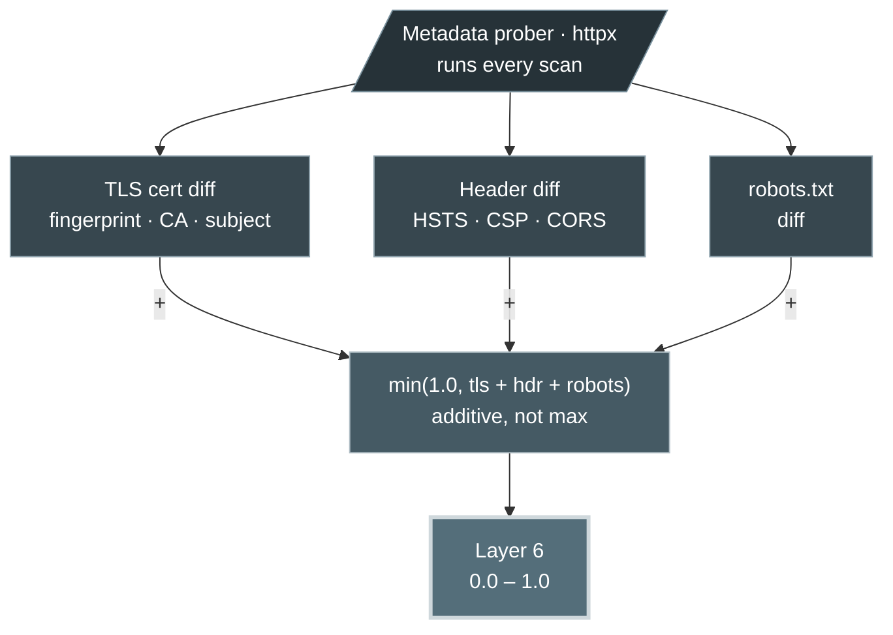

The **Security Metadata Layer** runs on the network transport and server configuration, not the page body. Even when the content hash is identical, this layer still executes — metadata changes are invisible to content hashing. It combines three weak, independent signals so that metadata alone pushes a scan toward "worth a look" rather than "confirmed defacement".

<Info>
  Source: `backend/worker/detection/metadata.py` (`layer6_security_metadata`, `_tls_diff`, `_header_diff`, `_robots_diff`). Inputs are captured by the metadata prober (`worker/probe.py`) and compared against what the baseline stored.
</Info>

## Signal fusion



The three sub-scores are **added** and clamped to `1.0`. Each is deliberately bounded so no single benign event maxes the layer.

## TLS certificate audit

The prober captures the peer certificate's fingerprint, issuer, subject, and validity window. `_tls_diff` grades the change:

| Situation | Score |
| :--- | :---: |
| No TLS data on either side (HTTP site or probe unavailable) | 0.0 |
| TLS data newly available, no baseline to compare | 0.0 |
| Fingerprint changed — **routine reissue** (same issuer, same subject) | 0.1 |
| Fingerprint changed — **different issuer or subject** (MITM / hijack / migration) | 0.55 |
| Certificate reported `expired` | ≥ 0.5 |
| Baseline had TLS but current probe returned **none** | 0.6 |

<Warning>
  **Correction on transport downgrades.** A lost TLS handshake where the baseline previously had one (`baseline TLS present, current absent`) scores **0.6**, not an automatic `1.0`. This is a strong signal but is fused with the other layers rather than unilaterally maxing the risk score. The prior docs' claim of a hard `1.0` HTTPS→HTTP alert does not match the code.
</Warning>

The key distinction the layer draws is between a *legitimate renewal* (same CA and subject, new fingerprint and expiry — scored 0.1) and a *suspicious swap* (new issuer or subject — scored 0.55), which is the signature of a hijack or unauthorized re-provisioning.

## HTTP security headers

`_header_diff` tracks six headers:

- `Content-Security-Policy`
- `Strict-Transport-Security` (HSTS)
- `X-Frame-Options`
- `X-Content-Type-Options`
- `Referrer-Policy`
- `Permissions-Policy`

Headers **disappearing or weakening** is a downgrade; headers **appearing** is an improvement and is recorded but not penalized.

```python
score = min(0.8, 0.3 * len(removed) + 0.1 * len(weakened))
```

<Note>
  If either side has no captured headers (an HTTP-only site, a degraded probe, or a Phase 1-era baseline), the comparison is **skipped** with a note rather than reporting every header as "removed" — a false positive the layer explicitly avoids.
</Note>

## robots.txt

The prober fetches `/robots.txt` alongside the main request. Defacers and SEO spammers alter it to index injected spam or drop the legitimate site from search. Any change scores a flat `0.15`, with added and removed lines recorded (capped at 30 each). Identical or absent-on-both-sides scores `0.0`.

## Independence from the content hash

<Warning>
  **Evasion mitigation.** Because Layer 6 runs regardless of the Layer 1 gate, an attacker cannot hide a DNS or BGP hijack by mirroring the legitimate HTML perfectly. The moment the mirrored content is served under a certificate with a different issuer or subject, `_tls_diff` contributes 0.55 to the fusion engine — even though the content hash matched.
</Warning>
