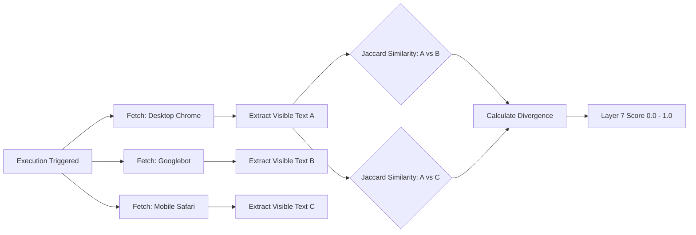

The **Cloaking Layer** identifies attacks designed to hide from the site owner while simultaneously poisoning search engine results (SEO Spam) or targeting specific devices.

A cloaked page inspects the incoming request (specifically the `User-Agent` HTTP header) and serves a completely different HTML document to a search engine crawler (like Googlebot) than it does to a standard browser. Because Wardress normally scans using a standard Desktop Chrome profile, a cloaked defacement would remain completely invisible to layers 1-5.

## Deep Dive Mechanism

Like Layer 6, this layer runs independently of the `layer1_hash` gate. It operates purely as an **intra-scan comparison**. It doesn't even use the baseline! It compares the responses of the *current* scan against each other.

<Steps>
  <Step title="Parallel Fetches">
    The prober re-fetches the target URL concurrently using three distinct HTTP requests, each with a different User-Agent profile:
    - `Desktop Chrome` (The Reference)
    - `Googlebot`
    - `Mobile Safari`
  </Step>
  <Step title="Text Extraction">
    The raw HTML responses are scrubbed of all tags, scripts, and CSS, leaving only the visible text.
  </Step>
  <Step title="Jaccard Token Comparison">
    The text strings are tokenized into sets of words. The Googlebot and Mobile Safari token sets are compared against the Desktop Chrome token set using a **Jaccard Similarity** algorithm (`Intersection over Union`).
  </Step>
  <Step title="Scoring">
    Mild dynamic variations between UAs (like responsive navigation labels saying "Menu" on mobile vs "Home, About" on desktop) result in a low score due to an algorithmic "soft knee" at `0.5` overlap. If the token divergence exceeds 50% (indicating entirely different content was served to the bot), the layer score scales rapidly toward `1.0`.
  </Step>
</Steps>

<Info>
  **Bot Blocking Handling**: If a site employs WAF rules that actively block `Googlebot` (returning `403 Forbidden` or a CAPTCHA challenge), Layer 7 recognizes this as legitimate bot-blocking, notes it in the evidence, and returns a `0.0` risk score. It *only* penalizes readable `2xx` responses that heavily diverge.
</Info>
