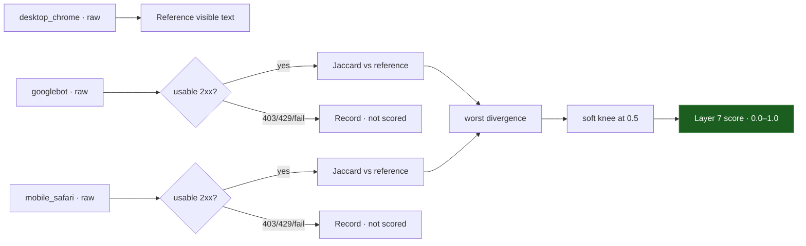

The **Cloaking Layer** catches pages that serve different content to a search-engine crawler than to a browser — a common way defacement and SEO spam hide from the site owner while poisoning search results. It is an **intra-scan** comparison: it never touches the baseline, only the responses gathered within the current scan.

<Info>
  Source: `backend/worker/detection/cloaking.py` (`layer7_cloaking`, `_text_similarity`, `_usable`). The UA variants are fetched by the metadata prober (`worker/probe.py`).
</Info>

## Raw fetches, compared apples-to-apples

The prober re-fetches the page over plain HTTP with **httpx (no JavaScript execution)** under three User-Agents:

- `desktop_chrome` — the reference
- `googlebot`
- `mobile_safari`

<Warning>
  Each rotated UA is compared against the **desktop raw fetch**, raw-vs-raw. The Playwright-rendered primary DOM is deliberately *not* used here — comparing a raw fetch against a JS-rendered page would false-flag every JavaScript-heavy site.
</Warning>



<Steps>
  <Step title="Locate the reference">
    The `desktop_chrome` variant is the reference. If it is missing, or its raw fetch is not a usable 2xx response, the layer returns `0.0` with a note — there is nothing to compare against.
  </Step>
  <Step title="Filter usable variants">
    A variant is usable only when it had no error and returned an HTTP status in the 2xx range. Bot-blocking responses (403, 429, CAPTCHA challenges) are common and legitimate — they are recorded in evidence and **not** scored as cloaking.
  </Step>
  <Step title="Compare">
    For each usable rotated variant, if its content hash equals the reference's, similarity is `1.0` (identical page — short-circuit). Otherwise visible text is extracted from both and compared with a Jaccard token-set overlap (intersection over union). The worst divergence (`1.0 − similarity`) across variants is kept.
  </Step>
  <Step title="Score with a soft knee">
    Token-set Jaccard exaggerates small edits on short pages, so a soft knee sits at 0.5:

    ```python
    score = (worst_divergence - 0.5) / 0.5 if worst_divergence > 0.5 else 0.0
    ```

    Divergence up to 50% scores `0.0` (responsive nav differences, minor dynamic bits); beyond 50% the score scales linearly toward `1.0`.
  </Step>
</Steps>

<Info>
  **Bot-blocking is not cloaking.** A WAF that returns `403` to Googlebot is scored `0.0` and noted — the layer only penalizes readable 2xx responses that diverge heavily. Multi-region fetching via proxy nodes is an optional feature that is not configured; the evidence records it as unavailable.
</Info>

## Independence from the content hash

Like Layer 6, this layer runs regardless of the Layer 1 gate. A cloaked page can serve identical content to the desktop scanner (matching the baseline hash exactly) while feeding a crawler an entirely different, spam-laden document. Only the UA rotation surfaces that divergence.
