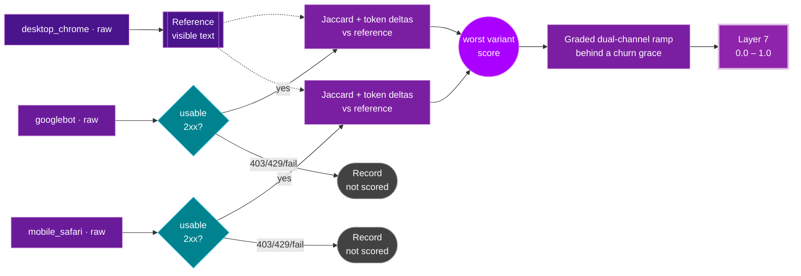

The **Cloaking Layer** catches pages that serve different content to a search-engine crawler than to a browser — a common way defacement and SEO spam hide from the site owner while poisoning search results. It is an **intra-scan** comparison: it never touches the baseline, only the responses gathered within the current scan.

<Info>
  Source: `backend/worker/detection/cloaking.py` (`layer7_cloaking`, `_text_similarity`, `_usable`). The UA variants are fetched by the metadata prober (`worker/probe.py`).
</Info>

## Raw fetches, compared apples-to-apples

The prober re-fetches the page over plain HTTP with **httpx (no JavaScript execution)** under three User-Agents:

- `desktop_chrome` — the reference
- `googlebot`
- `mobile_safari`

<Warning>
  Each rotated UA is compared against the **desktop raw fetch**, raw-vs-raw. The Playwright-rendered primary DOM is deliberately *not* used here — comparing a raw fetch against a JS-rendered page would false-flag every JavaScript-heavy site.
</Warning>

```mermaid actions={true}
flowchart LR
    REF["desktop_chrome · raw"]:::ref --> RT[["Reference<br/>visible text"]]:::ref
    GB["googlebot · raw"]:::ua --> C1{"usable<br/>2xx?"}:::gate
    MS["mobile_safari · raw"]:::ua --> C2{"usable<br/>2xx?"}:::gate
    C1 -->|"yes"| J1["Jaccard + token deltas<br/>vs reference"]:::node
    C2 -->|"yes"| J2["Jaccard + token deltas<br/>vs reference"]:::node
    C1 -->|"403/429/fail"| SKIP1(["Record<br/>not scored"]):::skip
    C2 -->|"403/429/fail"| SKIP2(["Record<br/>not scored"]):::skip
    RT -.-> J1
    RT -.-> J2
    J1 & J2 --> WD(("worst variant<br/>score")):::pick
    WD --> GR["Graded dual-channel ramp<br/>behind a churn grace"]:::node
    GR --> OUT["Layer 7<br/>0.0 – 1.0"]:::out

    classDef ref fill:#4a148c,stroke:#ba68c8,color:#fff;
    classDef ua fill:#6a1b9a,stroke:#ce93d8,color:#fff;
    classDef gate fill:#00838f,stroke:#4dd0e1,color:#fff;
    classDef node fill:#7b1fa2,stroke:#e1bee7,color:#fff;
    classDef skip fill:#424242,stroke:#9e9e9e,color:#fff,stroke-dasharray:4 3;
    classDef pick fill:#aa00ff,stroke:#ea80fc,color:#fff;
    classDef out fill:#8e24aa,stroke:#e1bee7,color:#fff,stroke-width:3px;
```

<Steps>
  <Step title="Locate the reference">
    The `desktop_chrome` variant is the reference. If it is missing or unusable — or no rotated variants were fetched at all (a dead probe) — the layer returns a **degraded** result (`score: null`) rather than a zero: fusion treats cloaking as *unknown*, not as a measured "no divergence". A target that refuses bot UAs is different: that is recorded per-variant and never scored.
  </Step>
  <Step title="Filter usable variants">
    A variant is usable only when it had no error and returned an HTTP status in the 2xx range. Bot-blocking responses (403, 429, CAPTCHA challenges) are common and legitimate — they are recorded in evidence and **not** scored as cloaking.
  </Step>
  <Step title="Compare">
    For each usable rotated variant, if its content hash equals the reference's, similarity is `1.0` (identical page — short-circuit). Otherwise visible text is extracted from both and compared with a Jaccard token-set overlap (intersection over union), and the differing token counts in each direction are kept.
  </Step>
  <Step title="Score with a churn grace, then grade">
    An absolute grace applies first: a pair differing by **12 or fewer** unique tokens scores `0.0` (`graced` in evidence) — timestamps, counters, and rotating widget text are request-to-request churn, not a content campaign, and the grace also neutralizes token-set Jaccard's exaggeration of trivial edits on short pages.

    Past the grace, divergence is graded from the *effective* additive divergence — the larger of the symmetric union-relative Jaccard divergence (`1 − |A∩B|/|A∪B|`, which saturates on total replacement) and the **new-token fraction** `|B∖A| / |A|` relative to the reference (which punishes injected spam independent of how much shared page vocabulary dilutes the union). Direction decides the ramp:

    - **Additive-dominant** (the crawler got extra foreign content): ramps from **0.15** to saturation at **0.85**.
    - **Removal-dominant**: ramps conservatively from **0.45**, because servers legitimately adapt content down for mobile UAs and normal responsive behavior must stay silent.

    The layer's score is the worst (highest) variant score.
  </Step>
</Steps>

<Info>
  **Bot-blocking is not cloaking.** A WAF that returns `403` to Googlebot is noted and never scored — the layer only penalizes readable 2xx responses that diverge heavily. Multi-region fetching via proxy nodes is an optional feature that is not configured; the evidence records it as unavailable.
</Info>

## Evidence recorded

Per variant: `similarity` (the raw Jaccard value), HTTP status/error, and when compared, the token accounting (`added_tokens`, `removed_tokens`, `reference_tokens`), `union_divergence`, `new_token_fraction`, and a `graced` flag when the churn grace silenced the pair. Top-level: `worst_divergence` plus a `scoring` anchor block naming the model and its ramp anchors.

## Independence from the content hash

Like Layer 6, this layer runs regardless of the Layer 1 gate. A cloaked page can serve identical content to the desktop scanner (matching the baseline hash exactly) while feeding a crawler an entirely different, spam-laden document. Only the UA rotation surfaces that divergence.
