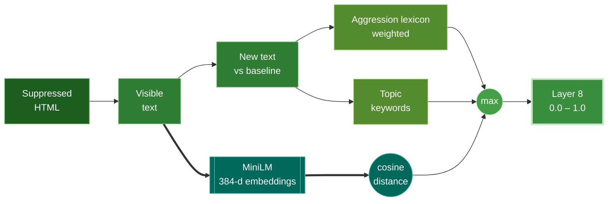

The **Semantics Layer** goes beyond exact string matching. If a corporate homepage is rewritten into propaganda, the markup may barely move but the *meaning* has drifted entirely. Layer 8 measures that with a neural sentence embedder, alongside a graded aggression lexicon and defacement topic keywords.

<Info>
  Source: `backend/worker/detection/semantics.py` (`layer8_semantics`, `embed_text`, `cosine_similarity`). It reuses Layer 5's `extract_visible_text` and `_new_text`.
</Info>

## Local, CPU-bound, private

All semantic analysis runs **locally on the worker**, CPU-only. Page text is never sent to an external API during scanning — zero API cost, and data stays on your infrastructure. The MiniLM model is process-cached after first load.

<Note>
  Optional Gemini/Ollama escalation (§8) is a separate path invoked by the scan task only for scans in an ambiguous risk band. The local pass never depends on it: the `escalation` evidence key records when it was not evaluated, and its absence never blocks scoring.
</Note>

## Three signals, take the max



### 1. Aggression lexicon (new text)

A graded lexicon scores threatening language on the new text — for example `no one is safe` (0.5), `you can't stop us` (0.5), `death to` (0.6), `pay the price` (0.4), `traitors` (0.3). The total weight saturates through an exponential:

```python
aggression_score = 1 - math.exp(-1.2 * aggression_weight)
```

### 2. Topic keywords (new text)

Four categories of defacement-adjacent vocabulary are matched: `breach_bragging` (breached, compromised, infiltrated), `credential_theft` (database dumped, leaked credentials), `defacement_meta` (index.html replaced, mirrored on zone), and `contact_defacer` (contact us on telegram, `t.me/...`). The score scales with the number of categories hit:

```python
topic_score = min(0.7, 0.35 * len(topic_hits))
```

### 3. Semantic drift (MiniLM-L6-v2)

Wardress loads `sentence-transformers/all-MiniLM-L6-v2` (CPU). It embeds the **full** baseline visible text and the full current visible text into 384-dimensional vectors and computes their cosine similarity. The drift score rises linearly as similarity falls below `0.85`:

```python
drift_score = max(0.0, min(1.0, (0.85 - semantic_similarity) / 0.85))
```

A cosine of `1.0` is identical meaning; meaning-level rewrites typically drop well below `0.8`.

<Tip>
  The drift score is computed only when both sides have non-empty visible text. If the MiniLM model cannot be loaded (a fresh container without the baked model and no network), `embed_text` returns `None`, similarity is unavailable, and drift contributes `0.0` — the scan still runs on the other two signals and the remaining layers. The model failing must never kill a scan.
</Tip>

### Final score

```python
score = max(aggression_score, topic_score, drift_score)
```

## Evidence recorded

Aggression hits with weights, the aggression weight sum, topic hits per category, the rounded semantic similarity (or `null` when unavailable), the drift score, new-text character count, and the escalation status.
