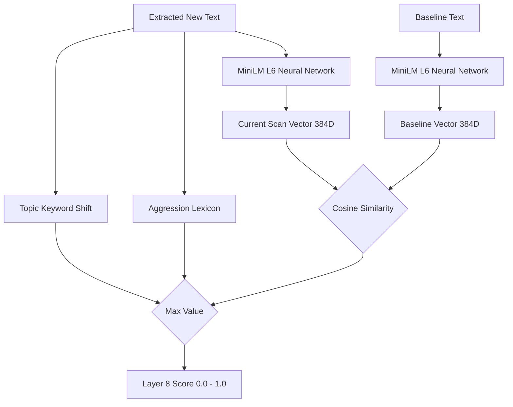

The **Semantics Layer** goes beyond exact string matching (like Layer 5) and attempts to understand the *meaning* of the text on the page. If a corporate homepage is replaced with political propaganda, the underlying DOM structure might look similar, but the semantics have completely drifted.

## Architecture

## Local, CPU-Bound Processing

Wardress performs all semantic analysis **locally on the worker node**. It does not send page text to external APIs (like OpenAI) during the high-throughput scanning phase. This ensures privacy, zero API costs, and compliance with strict data sovereignty requirements.

## Evaluation Mechanisms

This layer evaluates the visible text using three distinct methods, taking the `max()` of the three scores as the final layer output:

### 1. Topic Keyword Shift
It scans the *newly added text* against categorized threat topics (e.g., `breach_bragging`, `credential_theft`, `defacement_meta`). If words like "infiltrated", "database dumped", or "mirrored on zone" appear where they didn't exist before, the topic score spikes.

### 2. Aggression Lexicon
It applies a graded weight lexicon to the new text to measure aggression. Phrases like "pay the price", "no one is safe", or "traitors" carry high weights. The score is calculated using an exponential decay function based on the total aggression weight found.

### 3. Semantic Drift (MiniLM-L6-v2)
Wardress loads the `all-MiniLM-L6-v2` neural network model into memory (optimized for CPU execution).
1. It generates a 384-dimensional vector embedding for the entire Baseline visible text.
2. It generates a 384-dimensional vector embedding for the Current scan's visible text.
3. It calculates the **Cosine Similarity** between the two vectors.

<Tip>
  **Cosine Similarity Thresholds**: A cosine similarity of `1.0` means identical semantic meaning. If the similarity drops below `0.85`, it indicates a severe shift in meaning (semantic drift). The layer score scales up linearly as the cosine similarity drops below this threshold.
</Tip>
