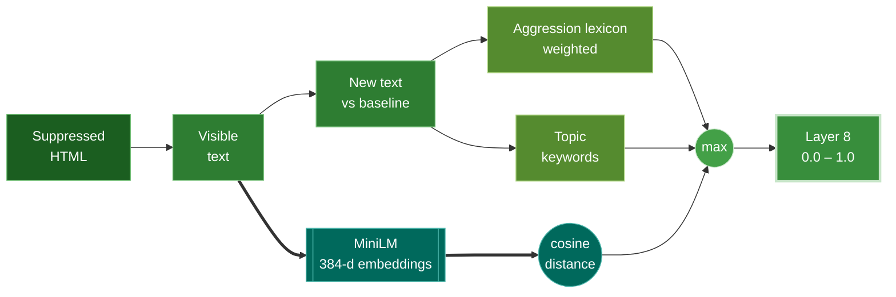

The **Semantics Layer** goes beyond exact string matching. If a corporate homepage is rewritten into propaganda, the markup may barely move but the *meaning* has drifted entirely. Layer 8 measures that with a neural sentence embedder, alongside a graded aggression lexicon and defacement topic keywords.

<Info>
  Source: `backend/worker/detection/semantics.py` (`layer8_semantics`, `embed_text`, `cosine_similarity`). It reuses Layer 5's `extract_visible_text` and `_new_text`.
</Info>

## Local, CPU-bound, private

All semantic analysis runs **locally on the worker**, CPU-only. Page text is never sent to an external API during scanning — zero API cost, and data stays on your infrastructure. The MiniLM model is process-cached after first load.

<Note>
  Optional Gemini/Ollama escalation (§8) is a separate path invoked by the scan task only for scans in an ambiguous risk band. The local pass never depends on it: the `escalation` evidence key records when it was not evaluated, and its absence never blocks scoring.
</Note>

## Three signals, take the max


```mermaid actions={true}
flowchart LR
    HTML["Suppressed<br/>HTML"]:::in --> VT["Visible<br/>text"]:::node
    VT --> NT["New text<br/>vs baseline"]:::node
    NT --> AG["Aggression lexicon<br/>weighted"]:::lex
    NT --> TP["Topic<br/>keywords"]:::lex
    VT ==> EMB[["MiniLM<br/>384-d embeddings"]]:::ml
    EMB ==> COS(("cosine<br/>distance")):::ml
    AG & TP & COS --> M(("max")):::pick
    M --> OUT["Layer 8<br/>0.0 – 1.0"]:::out

    classDef in fill:#1b5e20,stroke:#66bb6a,color:#fff;
    classDef node fill:#2e7d32,stroke:#81c784,color:#fff;
    classDef lex fill:#558b2f,stroke:#aed581,color:#fff;
    classDef ml fill:#00695c,stroke:#4db6ac,color:#fff;
    classDef pick fill:#43a047,stroke:#c8e6c9,color:#fff;
    classDef out fill:#388e3c,stroke:#c8e6c9,color:#fff,stroke-width:3px;
```

### 1. Aggression lexicon (new text)

A graded lexicon scores threatening language on the new text — for example `no one is safe` (0.5), `you can't stop us` (0.5), `death to` (0.6), `pay the price` (0.4), `traitors` (0.3). The lexicon also covers common non-Latin defacement-campaign phrasings (Arabic, Russian, and Chinese forms such as تم اختراق "(has) been hacked", сайт взломан "site hacked", 被黑 "got hacked"), which a purely English lexicon would score zero. The total weight saturates through an exponential:

```python
aggression_score = 1 - math.exp(-1.2 * aggression_weight)
```

### 2. Topic keywords (new text)

Four categories of defacement-adjacent vocabulary are matched: `breach_bragging` (breached, compromised, infiltrated), `credential_theft` (database dumped, leaked credentials), `defacement_meta` (index.html replaced, mirrored on zone), and `contact_defacer` (contact us on telegram, `t.me/...`, plus its Arabic equivalent). The score scales with the number of categories hit:

```python
topic_score = min(0.7, 0.35 * len(topic_hits))
```

### 3. Semantic drift (MiniLM-L6-v2, multi-window)

Wardress loads `sentence-transformers/all-MiniLM-L6-v2` (CPU). Rather than embedding each side once, both sides' visible texts are split into windows (~600 characters each, up to 24 per side) **spread across the whole text** — on pages beyond roughly 14,000 characters the same number of windows is distributed evenly instead of reading every character, so no region is ever invisible. Every window is matched against its *best-matching* window on the other side (so pure positional shifts don't read as drift); each direction's score is the length-weighted mean of those best matches, and the final similarity is the **lower of the two directions** — appended or rewritten content drops the current side, deleted content drops the baseline side, while shared content keeps both high. Total cost is bounded at 48 embed calls per scan no matter the page size.

The drift mapping is calibrated piecewise-linear interpolation over measured similarity bands, not a single linear slope:

| Similarity | Drift |
| :--- | :---: |
| ≥ 0.90 | 0.00 |
| 0.80 | 0.30 |
| 0.50 | 0.90 |
| ≤ 0.00 | 1.00 |

Benign dynamic churn measures cosine ≥ ~0.93 even after single-sentence edits (silent); partial injections and SEO spam land in the graded 0.75–0.90 band; meaning-level rewrites fall below ~0.6 (near-maximal drift). A similarity of exactly `1.0` maps to exactly `0.0`.

<Warning>
  **Tiny pages amplify drift.** Drift is proportional to how much of the page changed, so on a very small page (a ~40-word brochure or holding page) even a one-line tagline rewrite can be a large *share* of the text and clear the flag threshold — while the same edit on a normal-sized page stays quiet. If you monitor pages that small, raise the site's flag threshold (or add a suppression rule for the volatile region) rather than expecting silence at defaults.
</Warning>

<Tip>
  The drift score is computed only when both sides have non-empty visible text. If the MiniLM model cannot be loaded (a fresh container without the baked model and no network), `embed_text` returns `None`, similarity is unavailable, and drift contributes `0.0` — the scan still runs on the other two signals and the remaining layers. The model failing must never kill a scan.
</Tip>

### Final score

```python
score = max(aggression_score, topic_score, drift_score)
```

## Evidence recorded

Aggression hits with weights, the aggression weight sum, topic hits per category, the rounded semantic similarity (or `null` when unavailable), the drift score, the per-side window counts used for the comparison, the worst single-window similarity (`semantic_min_chunk_similarity`), new-text character count, and the escalation status.
