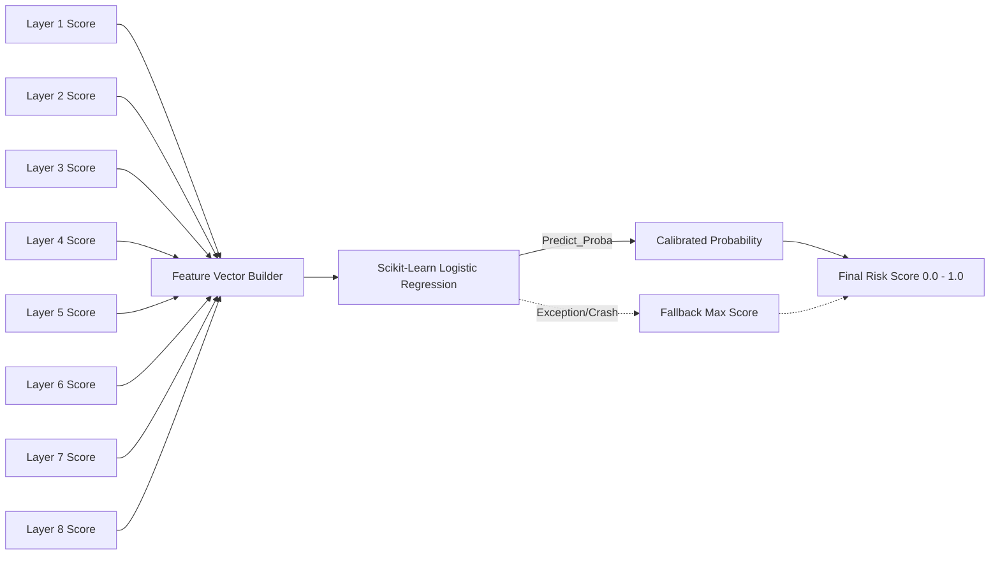

The **Risk Fusion Layer** is the final and most critical step in the pipeline. It takes the individual scores from Layers 1-8 and fuses them into a single, calibrated `risk_score` ranging from `0.0` to `1.0`.

## Architecture

## The Logistic Regression Model

Rather than relying on a hardcoded, brittle weighted-average formula, Wardress utilizes a **Scikit-Learn Logistic Regression** model (using the `lbfgs` solver) to calculate the final risk. 

At first boot, the model is deterministically fitted on a **Seed Dataset**. This dataset contains mathematically plotted layer-score vectors representing known real-world scenarios. By passing the layer scores through this trained classifier, Wardress can output a *calibrated probability* that the current scan represents a hostile defacement.

### The Seed Scenarios

The model is trained on distinct vectors engineered directly from how the sub-layers score. A few examples from the backend codebase include:

- **Clean Rescans**: `[0.0, 0.0, 0.0, 0.0, 0.0, 0.0, 0.0, 0.0]` -> `Label 0`
- **Dynamic Content Noise**: `[1.0, 0.05, 0.0, 0.02, 0.0, 0.0, 0.0, 0.0]` -> `Label 0` (The hash flipped, but visual and structural changes are tiny).
- **Benign Deploys**: `[1.0, 0.35, 0.25, 0.3, 0.0, 0.0, 0.0, 0.2]` -> `Label 0` (Real structural changes, but no hostile signatures or semantic drift).
- **Classic Full Defacement**: `[1.0, 0.9, 0.8, 0.85, 1.0, 0.5, 0.0, 0.9]` -> `Label 1` (Everything screams).
- **Stealthy Script Injection**: `[1.0, 0.4, 0.85, 0.1, 0.0, 0.0, 0.0, 0.1]` -> `Label 1` (Small DOM change, but a massive spike in unauthorized external domains).

<Info>
  **Future Upgrade Path**: By building the fusion layer on Scikit-Learn now, Wardress is architected for a drop-in upgrade path. Once enough scan history accumulates in your database, the seed dataset can be replaced with real, user-labeled historical data, stepping up to a Gradient Boosting model without requiring any changes to the pipeline itself.
</Info>

## Missing Data Handling & Fail-Safes

The fusion layer is designed to be incredibly robust under the **Fail-Safe Principle**. 

- **Skipped Layers**: If a specific layer was skipped (e.g., due to identical content hashing from Layer 1), it explicitly contributes `0.0` to the feature vector.
- **Layer Crashes**: If a layer crashes unexpectedly due to a parsing bug (e.g., malformed HTML crashes BeautifulSoup), it contributes `0.0`. A single broken parser must never blind the other eight layers.
- **Model Failure**: If the Logistic Regression model itself fails to load or execute (e.g., out of memory), Layer 9 automatically degrades to a simple `max()` function across all available sub-scores, ensuring the scan is still evaluated and alerted if necessary.
