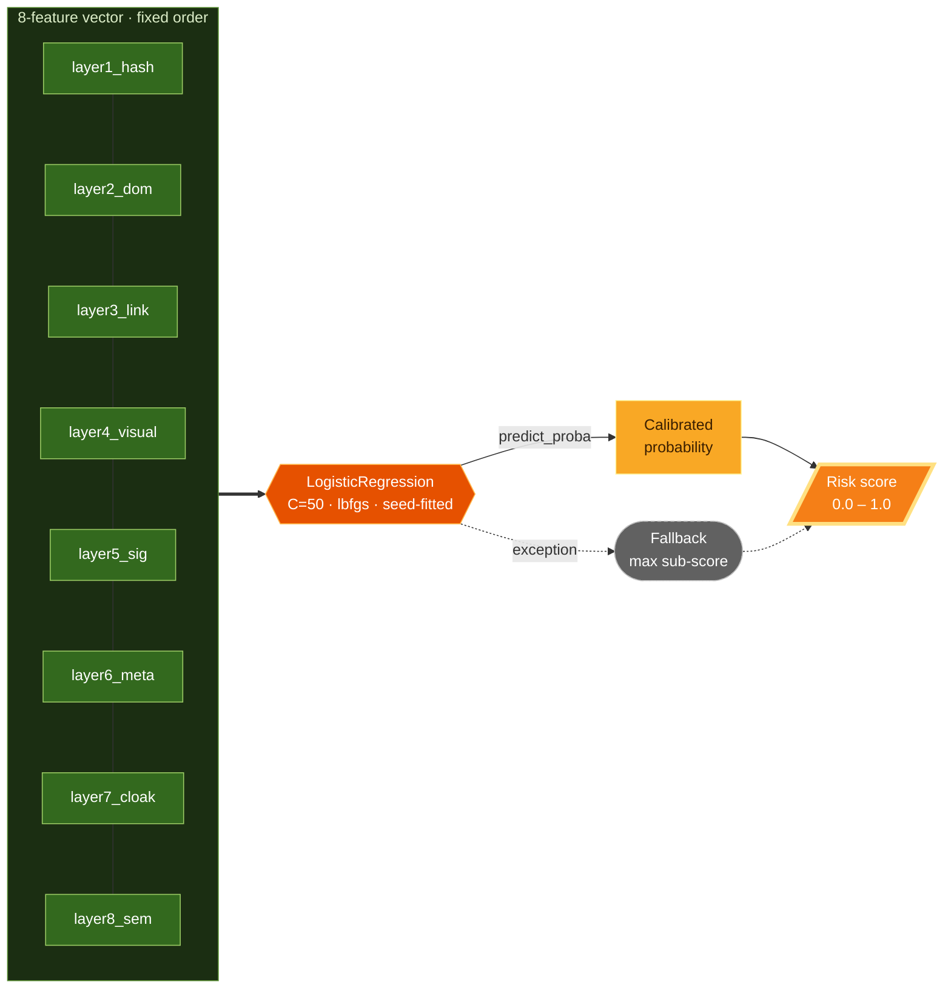

The **Risk Fusion Layer** is the final step. It flattens the scores from Layers 1–8 into a fixed-order feature vector and passes it through a calibrated classifier to produce a single `risk_score` in `[0.0, 1.0]`. This is the number that drives alerting, adaptive cadence, and remediation.

<Info>
  Source: `backend/worker/detection/fusion.py` (`layer9_fusion`, `get_fusion_model`, `build_feature_vector`). The classifier is a scikit-learn `LogisticRegression`.
</Info>

## The model

Rather than a brittle hand-tuned weighted average, fusion uses a `LogisticRegression(C=50.0, solver="lbfgs", max_iter=5000)`. The feature order (`FEATURE_KEYS`, layers 1–8) is fixed forever so that findings rows and any future retraining stay compatible. The fitted model is cached per worker process; fitting is deterministic (fixed seed data, fixed solver).

### Why a model instead of a formula

At install time there is no labeled scan history, so the model is fitted on a **seed dataset**: hand-authored layer-score vectors for documented scenarios. These encode the same domain knowledge a weighted sum would — but routing through logistic regression yields *calibrated probabilities* now and a drop-in upgrade path later.

The seed scenarios (from `_SEED_ROWS`) include:

| Scenario | Example vector (L1–L8) | Label |
| :--- | :--- | :---: |
| Clean rescan | `[0, 0, 0, 0, 0, 0, 0, 0]` | 0 |
| Dynamic-content noise | `[1, 0.05, 0, 0.02, 0, 0, 0, 0]` | 0 |
| Benign deploy | `[1, 0.35, 0.25, 0.3, 0, 0, 0, 0.2]` | 0 |
| Cert rotation only | `[0, 0, 0, 0, 0, 0.3, 0, 0]` | 0 |
| Classic full defacement | `[1, 0.9, 0.8, 0.85, 1.0, 0.5, 0, 0.9]` | 1 |
| Stealthy script injection | `[1, 0.4, 0.85, 0.1, 0, 0, 0, 0.1]` | 1 |
| Cloaking (browser clean) | `[0, 0, 0, 0, 0, 0, 0.95, 0]` | 1 |
| Visual takeover | `[1, 0.15, 0.05, 0.9, 0, 0, 0, 0.3]` | 1 |

<Info>
  **Upgrade path.** Once enough per-site scan history with operator verdicts accumulates, the seed set can be replaced with real labeled rows — and the model stepped up to gradient boosting — without touching the pipeline, because the feature contract never changes.
</Info>

## Evidence: full transparency

`layer9_fusion` records exactly how the score was reached, so the UI can show which layers actually voted:

- `model` — the model identifier.
- `features` — the rounded feature vector.
- `layers_ran` — a per-layer boolean `ran` mask (a skipped/gated layer is `False`).
- `contributions` — `coefficient × feature` per layer, revealing which signals pushed the score.
- `intercept` — the model intercept.

## Missing data and fail-safes

<AccordionGroup>
  <Accordion title="Skipped / gated layers" icon="forward">
    A layer that was gated or skipped contributes `0.0` to the vector and is marked `ran=False`. The gate already established "no change here", so a zero is the correct feature value.
  </Accordion>
  <Accordion title="Malformed sub-score" icon="triangle-exclamation">
    `_coerce_score` turns any non-numeric, `NaN`, or infinite sub-score into `0.0` rather than raising. A single misbehaving layer cannot corrupt the vector.
  </Accordion>
  <Accordion title="Model failure" icon="shield-halved">
    If the model cannot fit or predict, `layer9_fusion` degrades to `max()` of the available sub-scores and records a `fallback_max` note with the error — the scan is still evaluated and can still alert. Fusion never raises.
  </Accordion>
</AccordionGroup>

## Suppression and the fused score

<a id="suppression" />

Suppression rules ([configured per site](/configuration)) shape what the content layers compare, and their effect flows into fusion:

- **CSS-selector** and **regex** rules strip matching subtrees and text from *both* sides before Layers 2, 3, 5, and 8 run.
- **Bounding-box** rules mask screenshot regions for Layer 4.

Every applied — or unusable — rule is echoed into the affected layers' evidence and summarized on the fusion result, so a suppressed signal stays auditable and never becomes silently invisible. Layer 1 always hashes the *original* content: suppression can gate downstream scores but can never hide that bytes changed.

## Adaptive cadence

The fused score feeds back into scheduling. When a scan crosses the material-change threshold, the next scan interval tightens; sustained clean scans relax it back toward the site's base interval. See [Detection Pipeline](/detection-layers#adaptive-cadence-scanning) for the exact formula.
