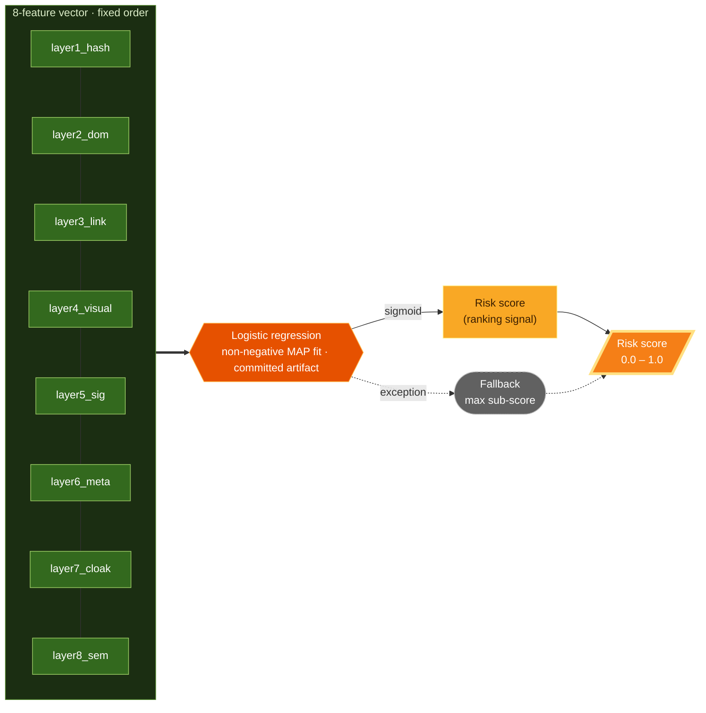

The **Risk Fusion Layer** is the final step. It flattens the scores from Layers 1–8 into a fixed-order feature vector and passes it through a fitted logistic regression to produce a single `risk_score` in `[0.0, 1.0]`. This is the number that drives alerting, adaptive cadence, and remediation. The score is a **ranking signal**, not a calibrated probability — treat it as "more/less evidence of defacement," not as an expected frequency.

<Info>
  Source: `backend/worker/detection/fusion.py` (`layer9_fusion`, `get_fusion_model`, `build_feature_vector`). The deployed model is a committed artifact (`training/fusion_model.json`); rule-based minimum-risk floors compose with it.
</Info>

## The model

```mermaid actions={true}
flowchart LR
    subgraph V["8-feature vector · fixed order"]
      direction TB
      L1["layer1_hash"]:::feat --- L2["layer2_dom"]:::feat
      L2 --- L3["layer3_link"]:::feat
      L3 --- L4["layer4_visual"]:::feat
      L4 --- L5["layer5_sig"]:::feat
      L5 --- L6["layer6_meta"]:::feat
      L6 --- L7["layer7_cloak"]:::feat
      L7 --- L8["layer8_sem"]:::feat
    end
    V ==> MODEL{{"Logistic regression<br/>non-negative MAP fit · committed artifact"}}:::model
    MODEL -->|sigmoid| PROB["Risk score<br/>(ranking signal)"]:::node
    PROB --> OUT[/"Risk score<br/>0.0 – 1.0"/]:::out
    MODEL -.->|"exception"| MAX(["Fallback<br/>max sub-score"]):::fallback
    MAX -.-> OUT

    classDef feat fill:#33691e,stroke:#9ccc65,color:#fff;
    classDef model fill:#e65100,stroke:#ffb74d,color:#fff;
    classDef node fill:#f9a825,stroke:#fff59d,color:#3b1f00;
    classDef fallback fill:#616161,stroke:#bdbdbd,color:#fff,stroke-dasharray:4 3;
    classDef out fill:#f57f17,stroke:#ffe082,color:#fff,stroke-width:4px;
    style V fill:#1b2e12,stroke:#558b2f,color:#dcedc8;
```

Rather than a brittle hand-tuned weighted average, fusion uses a logistic regression whose coefficients were **constrained non-negative** during fitting, so fused risk is monotone in every evidence channel by construction — more attack evidence can never lower the score. The feature order (`FEATURE_KEYS`, layers 1–8) is fixed forever so that findings rows and any future retraining stay compatible. The model ships as a committed artifact (`worker/detection/training/fusion_model.json`) produced by `tools/refit_fusion_model.py` from the measured dataset in `training/fusion_dataset.json`; loading validates the schema, feature order, and non-negativity constraint and refuses anything else. The loaded model is cached per worker process; loading is deterministic (fixed artifact bytes).

### Why a model instead of a formula

At install time there is no labeled scan history, so the deployed fit was trained on a **synthetic measured dataset**: procedurally generated benign-drift and attack scenarios run through the real detection layers to produce labeled 8-feature vectors (balanced classes, stratified across evasion axes and languages, with train/validation/held-out-test splits recorded inside the artifact alongside cross-validation and calibration metrics). The fit is deliberately conservative — a one-standard-error regularization choice avoids saturating on separable training rows — because the coarse eight-dimensional space genuinely cannot separate some profiles (notably "operator added third-party scripts" from "attacker injected scripts"; their measured vectors collide). Per-site suppression rules and the human confirmation queue are the designed mitigations where features cannot decide.

Rule-based **minimum-risk floors** compose with the model: wherever individual layer evidence is unambiguous — strong defacement signatures or severe crawler cloaking (score ≥ 0.85 → floor 0.90), or brand-new external script/iframe/form-action domains (weighted count ≥ ~0.89 → floor 0.40, inside the LLM escalation band) — the final score is `max(model probability, floor)`. Floors read only the fixed feature vector, are independent of any future refit, and guarantee that low-churn single-vector attacks cannot be laundered below review by padding benign churn into other channels.

## Evidence: full transparency

`layer9_fusion` records exactly how the score was reached, so the UI can show which layers actually voted:

- `model` — the model identifier.
- `model_artifact` — deployed-artifact provenance (file, selected regularization, dataset hash).
- `features` — the rounded feature vector.
- `layers_ran` — a per-layer boolean `ran` mask (a skipped/gated layer is `False`).
- `contributions` — `coefficient × feature` per layer, revealing which signals pushed the score.
- `intercept` — the model intercept.
- `confidence_mass` — share of the model's evidence mass that actually measured this scan; degraded channels are listed under `unmeasured`.
- `rule_floor` — present only when a minimum-risk floor fired, naming the rule and the model's own probability.

## Missing data and fail-safes

<AccordionGroup>
  <Accordion title="Skipped / gated layers" icon="forward">
    A layer that was gated or skipped contributes `0.0` to the vector and is marked `ran=False`. The gate already established "no change here", so a zero is the correct feature value.
  </Accordion>
  <Accordion title="Malformed sub-score" icon="triangle-exclamation">
    `_coerce_score` turns any non-numeric, `NaN`, or infinite sub-score into `0.0` rather than raising. A single misbehaving layer cannot corrupt the vector.
  </Accordion>
  <Accordion title="Model failure" icon="shield-halved">
    If the model cannot fit or predict, `layer9_fusion` degrades to `max()` of the available sub-scores and records a `fallback_max` note with the error — the scan is still evaluated and can still alert. Fusion never raises.
  </Accordion>
</AccordionGroup>

## Suppression and the fused score

<a id="suppression" />

Suppression rules ([configured per site](/configuration)) shape what the content layers compare, and their effect flows into fusion:

- **CSS-selector** and **regex** rules strip matching subtrees and text from *both* sides before Layers 2, 3, 5, and 8 run.
- **Bounding-box** rules mask screenshot regions for Layer 4.

Every applied — or unusable — rule is echoed into the affected layers' evidence and summarized on the fusion result, so a suppressed signal stays auditable and never becomes silently invisible. Layer 1 always hashes the *original* content: suppression can gate downstream scores but can never hide that bytes changed.

## Adaptive cadence

The fused score feeds back into scheduling. When a scan crosses the material-change threshold, the next scan interval tightens; sustained clean scans relax it back toward the site's base interval. See [Detection Pipeline](/detection-layers#adaptive-cadence-scanning) for the exact formula.
